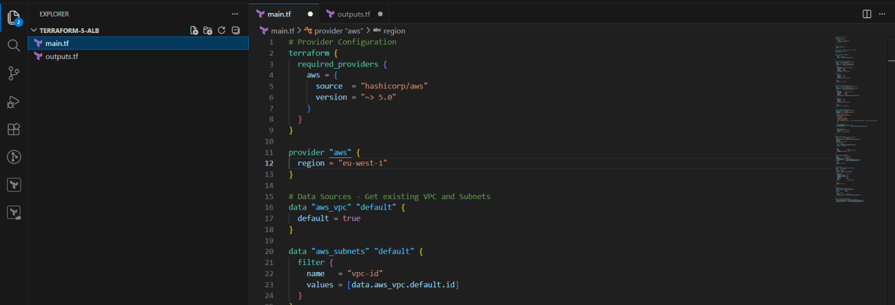
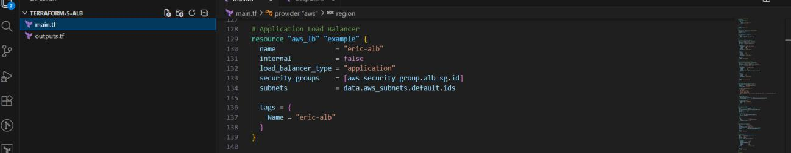
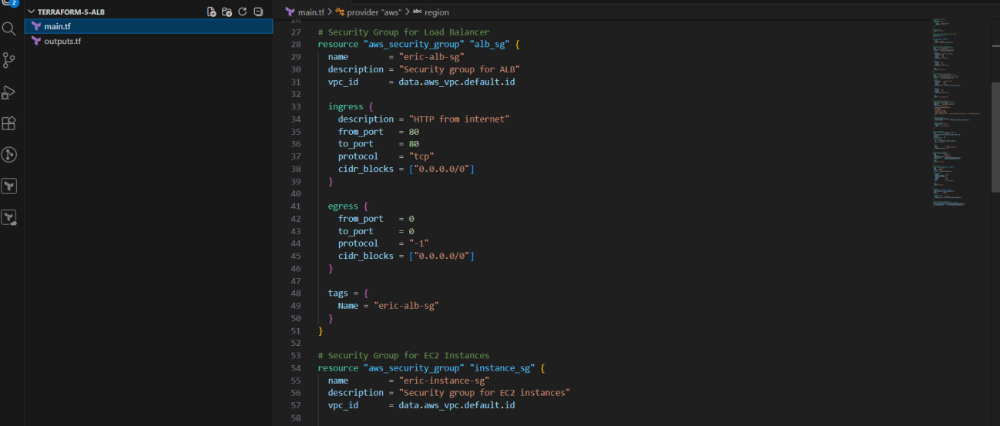
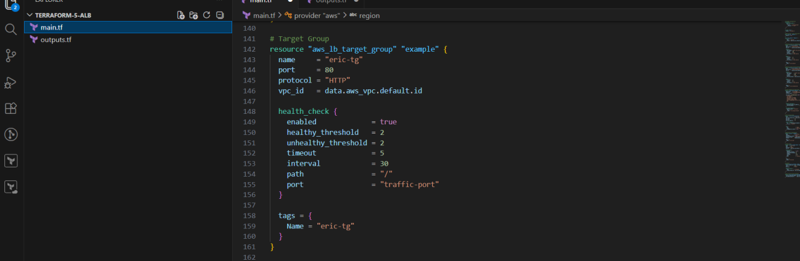
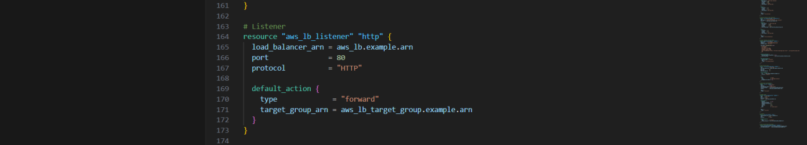
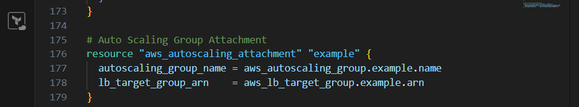
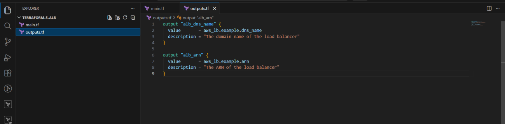
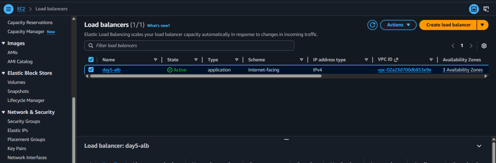
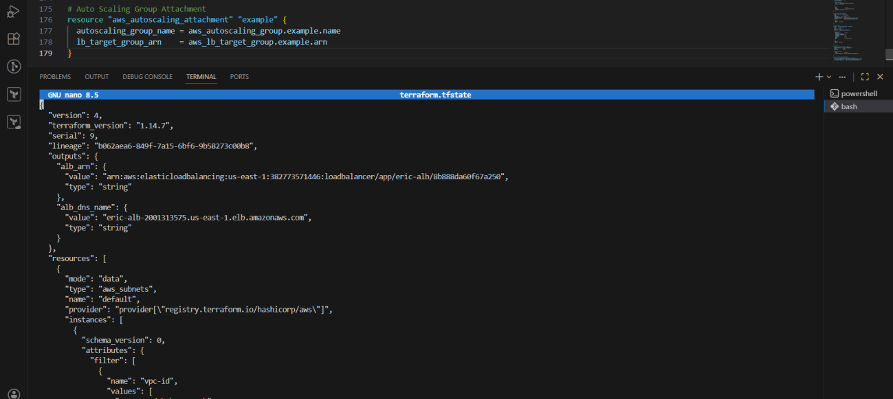

# 🚀 Day 5 – Scaling Infrastructure and Understanding Terraform State

> **#100DaysOfDevOps** | Terraform | AWS ALB | Auto Scaling | State Management | Drift Detection


---

## 📌 Project Overview

Day 5 tackled two critical pillars of production-ready Terraform infrastructure:

**Part 1 — Scaling with an Application Load Balancer**  
I deployed an ALB in front of my Auto Scaling Group, enabling traffic distribution across multiple EC2 instances and achieving true high availability.

**Part 2 — Understanding Terraform State**  
I explored how Terraform's `terraform.tfstate` file works as the single source of truth, ran hands-on experiments with state tampering and drift detection, and learned best practices for state management in team environments.

---

## 🛠️ Tools & Services Used

| Category | Tools |
|---|---|
| **IaC Tool** | Terraform (HashiCorp) |
| **Compute** | Amazon EC2, Auto Scaling Groups |
| **Networking** | Application Load Balancer (ALB), Target Groups, Listeners |
| **Security** | AWS IAM, Security Groups |
| **CLI** | AWS CLI |
| **Editor** | Visual Studio Code |

---

## 💡 Key Concepts Learned

| Concept | Description |
|---|---|
| **ALB + ASG Integration** | Load balancer sits in front of the ASG, distributing traffic across all healthy instances |
| **Target Group Health Checks** | ALB continuously checks instance health before routing traffic |
| **Terraform State (`tfstate`)** | JSON file tracking every resource Terraform manages — the source of truth |
| **State Drift** | When real infrastructure differs from what Terraform expects |
| **Drift Detection** | `terraform plan` compares real infra with state and flags differences |
| **Remote State** | Storing state in S3 for team collaboration and security |
| **State Locking** | Prevents concurrent modifications that could corrupt state |

---

## 📁 Project Structure

```
terraform-5-alb/
├── main.tf       # ALB, ASG, security groups, target group, listener
└── outputs.tf    # ALB DNS name and ARN outputs
```



---

## 🏗️ Part 1 — Scaling with an Application Load Balancer

### Architecture

Traffic now flows through a fully managed load-balanced stack:

```
Internet (HTTP port 80)
        ↓
Application Load Balancer (ALB)  ← internet-facing, public subnets
        ↓
    Listener (port 80, HTTP)
        ↓
  Target Group (health checks → path "/", port 80)
        ↓
Auto Scaling Group
  ├── EC2 Instance (AZ-a)
  ├── EC2 Instance (AZ-b)
  └── EC2 Instance (AZ-c)
```

### Terraform Configuration

**Application Load Balancer**

Creates a public-facing ALB across all default subnets.



**Security Groups**

Two security groups are defined — one for the ALB (allows HTTP from anywhere) and one for the EC2 instances (allows traffic only from the ALB).



**Target Group**

Defines where ALB sends traffic and how health checks are performed.

```hcl
resource "aws_lb_target_group" "example" {
  name     = "eric-tg"
  port     = 80
  protocol = "HTTP"
  vpc_id   = data.aws_vpc.default.id

  health_check {
    enabled             = true
    healthy_threshold   = 2
    unhealthy_threshold = 2
    timeout             = 5
    interval            = 30
    path                = "/"
    port                = "traffic-port"
  }
}
```



**Listener**

Forwards all incoming HTTP requests to the target group.



**Auto Scaling Group Attachment**

Links the ASG to the ALB target group so new instances are automatically registered.

```hcl
resource "aws_autoscaling_attachment" "example" {
  autoscaling_group_name = aws_autoscaling_group.example.name
  lb_target_group_arn    = aws_lb_target_group.example.arn
}
```



**Outputs**

Exposes the ALB DNS name and ARN after deployment.



---

### Deployment

After running the standard Terraform workflow:

```bash
terraform init
terraform plan
terraform apply
```

All resources were created and connected successfully. The ALB DNS name was available in the outputs, and the application was accessible through the browser.

**AWS Console — Load Balancer & Target Group confirmed active:**



**High Availability Test:** I stopped one EC2 instance manually. The ALB automatically routed traffic to the remaining healthy instances — the application never went down. ✅

---

## 🗂️ Part 2 — Understanding Terraform State

### What Is Terraform State?

Terraform stores all managed infrastructure details in `terraform.tfstate` — a JSON file that acts as the **source of truth**. It contains resource IDs, ARNs, attributes, configurations, and dependency relationships. Every `terraform plan` or `terraform apply` reads this file to decide what changes are needed.



---

### Experiment 1 — Manual State Tampering

I manually edited `terraform.tfstate` and changed a resource attribute directly.

**Result:** Running `terraform plan` immediately detected the mismatch between the state file and the real infrastructure, and proposed corrections to reconcile them.

**Lesson:** Terraform's decision-making is driven entirely by the state file. Editing it manually is dangerous and should be avoided in production.

---

### Experiment 2 — State Drift

I manually changed a resource attribute (a tag) directly in the AWS Console — without touching any Terraform code.

**Result:** Running `terraform plan` detected the drift and proposed reverting the manual change to match the desired configuration.

**Lesson:** Terraform continuously compares real infrastructure with the declared configuration. Any out-of-band changes will be detected and flagged.

---

### Terraform Block Reference

| Block | Purpose | When to Use | Example |
|---|---|---|---|
| `provider` | Configures cloud provider | Once per provider | `provider "aws" { region = "us-east-1" }` |
| `resource` | Creates infrastructure | Every resource | `resource "aws_lb" "example" {}` |
| `variable` | Defines inputs | Avoid hardcoding | `variable "instance_type" {}` |
| `output` | Displays values after apply | Expose useful info | `output "alb_dns" {}` |
| `data` | Fetches existing resources | Reference external infra | `data "aws_vpc" "default" {}` |

---

### State Management Best Practices

**Remote State (S3)**  
Store `terraform.tfstate` in Amazon S3 for team access and durability. Never commit state files to version control — they may contain sensitive credentials and resource details.

**State Locking (DynamoDB)**  
Use DynamoDB table locking alongside S3 to prevent two engineers from running `terraform apply` simultaneously, which could corrupt the state file.

```hcl
terraform {
  backend "s3" {
    bucket         = "my-terraform-state"
    key            = "prod/terraform.tfstate"
    region         = "us-east-1"
    dynamodb_table = "terraform-locks"
  }
}
```

---

## 🐛 Challenges & Fixes

| Challenge | Root Cause | Fix |
|---|---|---|
| Load balancer couldn't reach EC2 instances | Misconfigured security group — no inbound rule from ALB | Added ingress rule allowing HTTP from the ALB security group |
| Target group health checks failing | App not responding on the configured health check path | Ensured the web server responded correctly on `"/"` |
| Missing AWS credentials error | AWS CLI not configured | Ran `aws configure` to set access key, secret, and region |

---

## 🪞 Reflection

This project made two things very clear:

1. **Deploying infrastructure is only half the job.** Keeping it consistent, detecting drift, and managing state are equally important — and often harder in practice.

2. **Terraform state is not just a file — it's the foundation of everything.** Breaking it (even accidentally) can mean Terraform loses track of your entire infrastructure. Understanding how to protect and manage it is a core DevOps skill.

Testing high availability by stopping an instance and watching the ALB seamlessly route traffic to the remaining ones was the most satisfying part of this project — it made the architecture feel real.

---

## 📚 Resources

- [Terraform AWS ALB Documentation](https://registry.terraform.io/providers/hashicorp/aws/latest/docs/resources/lb)
- [Terraform State Documentation](https://developer.hashicorp.com/terraform/language/state)
- [AWS Application Load Balancer Guide](https://docs.aws.amazon.com/elasticloadbalancing/latest/application/introduction.html)
- [Remote State with S3](https://developer.hashicorp.com/terraform/language/settings/backends/s3)

---

## 🔗 Series Navigation

| Day | Topic | Link |
|---|---|---|
| Day 1 | Introduction to Terraform | Coming soon |
| Day 2 | Terraform State Management | Coming soon |
| Day 3 | Deploying an EC2 Instance | Coming soon |
| Day 4 | Variables, ASG & Load Balancing | [View](../day-04-variables-asg-alb/) |
| **Day 5** | **Scaling Infrastructure & Terraform State** | **You are here** |
| Day 6 | Terraform Modules | Coming soon |

---

*Part of my [#100DaysOfDevOps](https://github.com/ericgitau-tech) challenge — building real-world cloud infrastructure one day at a time.*
