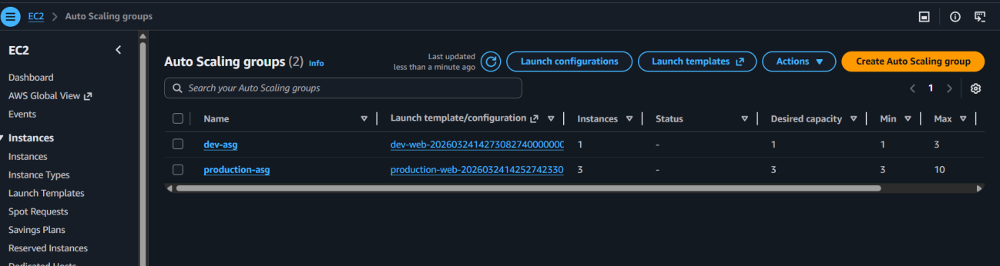
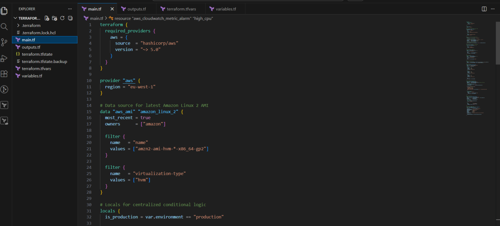
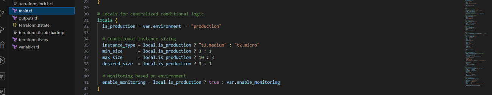
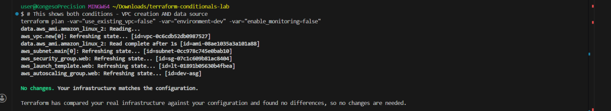
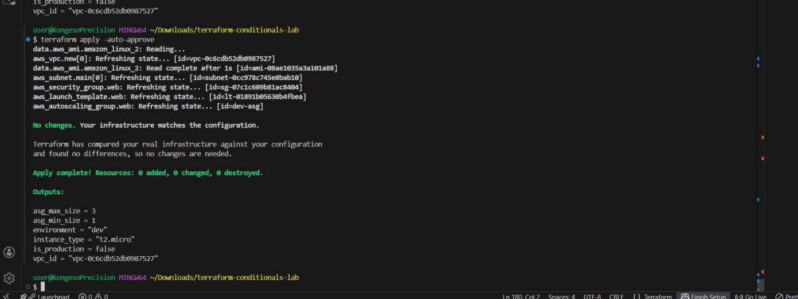

# 🚀 Day 11 – Mastering Terraform Conditionals: Smarter, More Flexible Deployments

> **#100DaysOfDevOps** | Terraform | AWS EC2 | CloudWatch | ASG | Conditional Logic


---

## 📌 Project Overview

In Day 11, I tackled one of the most powerful features of Terraform: **conditionals**. Previously, managing dev, staging, and production meant maintaining separate configuration files. Today, I refactored everything into a **single, flexible configuration** that adapts its behaviour based on a single input variable.

Terraform conditionals allow infrastructure to respond dynamically to:

- **Environment** — dev gets `t2.micro`, production gets `t2.medium`, scaling limits, and monitoring automatically
- **Feature toggles** — enable or disable entire resources (e.g., CloudWatch alarms) with a boolean flag
- **Greenfield vs Brownfield** — decide at deploy time whether to create a new VPC or use an existing one

By the end, I had a fully environment-aware module with zero duplication, built-in validation, and clean conditional logic centralised in a `locals` block.



---

## 🛠️ Tools & Services Used

| Category | Tools |
|---|---|
| **IaC Tool** | Terraform (HashiCorp) |
| **Compute** | Amazon EC2, Auto Scaling Groups (ASG) |
| **Monitoring** | Amazon CloudWatch |
| **DNS** | Amazon Route 53 |
| **Editor** | Visual Studio Code |

---

## 💡 Key Concepts Learned

| Concept | Description |
|---|---|
| **Ternary Expression** | `condition ? true_val : false_val` — selects a value based on a condition |
| **Conditional Count** | `count = var.enable ? 1 : 0` — creates or skips an entire resource |
| **Locals Block** | Centralises all conditional logic in one place for readability and reuse |
| **Input Validation** | Rejects invalid variable values at `plan` time before anything is deployed |
| **Conditional Data Source** | Queries existing infrastructure or creates new — toggled by a boolean |
| **Environment-Aware Modules** | Single config that behaves correctly across dev, staging, and production |



---

## 📋 Conditionals Quick Reference

| Technique | Syntax | Use Case |
|---|---|---|
| **Ternary Expression** | `condition ? true_val : false_val` | Select a value based on a condition (e.g. instance type) |
| **Conditional Count** | `count = var.enable ? 1 : 0` | Create or skip an entire resource based on a boolean |
| **Locals Block** | `locals { is_prod = var.env == "production" }` | Centralise repeated conditional logic in one place |
| **Input Validation** | `condition = contains([...], var.x)` | Reject invalid inputs at plan time with clear error messages |
| **Conditional Data Source** | `count = var.use_existing ? 1 : 0` | Query existing infra or create new depending on a toggle |

---

## 🧠 Section 4 — Locals: Centralised Conditional Logic

Instead of scattering ternary expressions across every resource block, I centralised all conditional logic inside a single `locals` block. This means every environment-specific decision is made in **one visible place** — making the configuration far easier to read, debug, and maintain.



```hcl
locals {
  is_production    = var.environment == "production"
  instance_type    = local.is_production ? "t2.medium" : "t2.micro"
  min_size         = local.is_production ? 3 : 1
  max_size         = local.is_production ? 10 : 3
  enable_monitoring = local.is_production
}
```

Setting `environment = "production"` automatically cascades the correct instance type, scaling limits, and monitoring settings across the entire configuration — with **zero manual changes** anywhere else.

---

## ⚙️ Section 5 — Conditional Resource Creation with `count`

The `count` meta-argument controls whether a resource exists at all. `count = 0` tells Terraform to skip the resource entirely; `count = 1` creates it.

```hcl
variable "enable_monitoring" {
  type    = bool
  default = false
}

resource "aws_cloudwatch_metric_alarm" "high_cpu" {
  count      = var.enable_monitoring ? 1 : 0
  alarm_name = "high-cpu"
  # ... rest of alarm config
}
```

**Behaviour:**
- `true` → resource is created (`count = 1`)
- `false` → resource is skipped entirely (`count = 0`)

### ⚠️ Safe Output References

When `count` is used, referencing the resource directly in an output will throw an **"index out of range"** error at plan time if the resource doesn't exist. The safe pattern uses a ternary with an index:

```hcl
# ❌ Wrong — throws "index out of range" if count = 0
output "alarm_arn" {
  value = aws_cloudwatch_metric_alarm.high_cpu.arn
}

# ✅ Correct — safely handles both cases
output "alarm_arn" {
  value = var.enable_monitoring
    ? aws_cloudwatch_metric_alarm.high_cpu[0].arn
    : null
}
```

---

## 🌍 Section 6 — Environment-Aware Module

I built a single module driven by one `environment` variable that controls all infrastructure decisions. The variable includes built-in validation to reject typos and invalid values **before** any infrastructure is touched.

```hcl
variable "environment" {
  description = "Deployment environment"
  type        = string

  validation {
    condition     = contains(["dev", "staging", "production"], var.environment)
    error_message = "Environment must be dev, staging, or production."
  }
}
```

**Environment-Driven Locals:**

```hcl
locals {
  is_production    = var.environment == "production"
  instance_type    = local.is_production ? "t2.medium" : "t2.micro"
  min_size         = local.is_production ? 3 : 1
  max_size         = local.is_production ? 10 : 3
  enable_monitoring = local.is_production
}
```

**Deployment examples — one config, two completely different outcomes:**

```bash
# Development — small instances, minimal scaling, monitoring off
terraform apply -var="environment=dev"

# Production — larger instances, higher scaling, monitoring on
terraform apply -var="environment=production"
```

| Setting | Dev | Production |
|---|---|---|
| Instance Type | `t2.micro` | `t2.medium` |
| Min Instances | 1 | 3 |
| Max Instances | 3 | 10 |
| CloudWatch Monitoring | ❌ Off | ✅ On |

---

## 🛡️ Section 7 — Input Validation

Terraform's `validation` block catches misconfigured inputs at `terraform plan` time — before any resources are created or modified. This protects the infrastructure from operator errors.

```hcl
validation {
  condition     = contains(["dev", "staging", "production"], var.environment)
  error_message = "Environment must be dev, staging, or production."
}
```

**Example plan-time error:**

```
Error: Invalid value for variable

  on main.tf line 3, in variable "environment":
   3: variable "environment" {

Environment must be dev, staging, or production.
```

The plan fails immediately — nothing is deployed, nothing is changed. This is the Terraform equivalent of type safety in a programming language.

---

## 🔀 Section 8 — Conditional Data Source: Greenfield vs Brownfield

A common real-world challenge: sometimes you're deploying into a fresh AWS account (greenfield), and sometimes you need to integrate with existing infrastructure (brownfield). I implemented a clean toggle pattern to handle both with a single configuration.

```hcl
variable "use_existing_vpc" {
  type    = bool
  default = false
}

# Query existing VPC — only if the toggle is true
data "aws_vpc" "existing" {
  count = var.use_existing_vpc ? 1 : 0
  tags  = { Name = "existing-vpc" }
}

# Create a new VPC — only if the toggle is false
resource "aws_vpc" "new" {
  count      = var.use_existing_vpc ? 0 : 1
  cidr_block = "10.0.0.0/16"
}

# Unified local — always resolves to the correct VPC ID regardless of toggle
locals {
  vpc_id = var.use_existing_vpc
    ? data.aws_vpc.existing[0].id
    : aws_vpc.new[0].id
}
```

The `locals.vpc_id` value is always correct regardless of which path was taken — all downstream resources reference `local.vpc_id` with no branching logic needed anywhere else.

**Use cases:**
- `use_existing_vpc = true` → query and integrate with existing VPC (brownfield)
- `use_existing_vpc = false` → create a fresh VPC (greenfield)



---

## 📚 Section 9 — Key Distinctions (Chapter 5 Learnings)

These are the nuances that separate a solid understanding of Terraform conditionals from surface-level knowledge:

| Concept | Clarification |
|---|---|
| **Ternary vs count** | A ternary selects a *value* — it doesn't add or remove resources. `count` controls whether a resource *exists* at all. |
| **You can't switch resource types** | You cannot use a conditional to choose between `aws_instance` and `aws_db_instance` — Terraform requires a predictable resource graph at plan time. |
| **Locals reduce duplication** | Centralising logic in `locals` means a single change propagates everywhere — no hunting through resource blocks. |
| **Validation catches errors early** | Input validation fires at `plan` time, not `apply` — the safest possible point to catch misconfiguration. |



---

## 🐛 Challenges & Fixes

| Challenge | Fix Applied |
|---|---|
| **Index out of range error on output** | Used `[0]` index with a ternary: `var.enable ? resource[0].arn : null` |
| **Validation rejecting correct values** | Corrected input spelling to exactly match the allowed values list |
| **Plan-time errors on conditionals** | Ensured all conditional expressions resolve cleanly at plan time without referencing potentially non-existent resources directly |

---

## 🪞 Reflection

Before Day 11, managing multiple environments meant maintaining multiple config files — which meant drift, duplication, and human error. Conditionals collapse all of that into a **single source of truth** that's controlled by one variable.

The most practically valuable pattern was the **locals block approach**. Instead of embedding ternary logic directly in resource arguments, centralising it means you can read the entire decision tree in 10 lines — and change it in one place.

The greenfield/brownfield conditional data source pattern is something I expect to use in real production work immediately — it's exactly the kind of flexibility that makes Terraform configurations reusable across different AWS accounts and environments.

---

## 🔗 Series Navigation

| Day | Topic | Link |
|---|---|---|
| Day 7 | State Isolation — Workspaces vs File Layouts | [View](../day-07-state-isolation-workspaces-filelayouts/) |
| Day 8–10 | Coming soon | — |
| **Day 11** | **Terraform Conditionals** | **You are here** |
| Day 12 | Terraform Loops — `for_each`, `for`, Dynamic Blocks | Coming soon |

---

📎 **GitHub:** [github.com/ericgitau-tech/30-days-terraform-challenge](https://github.com/ericgitau-tech/30-days-terraform-challenge)

*Part of my [#100DaysOfDevOps](https://github.com/ericgitau-tech) challenge — building real-world cloud infrastructure one day at a time.*
