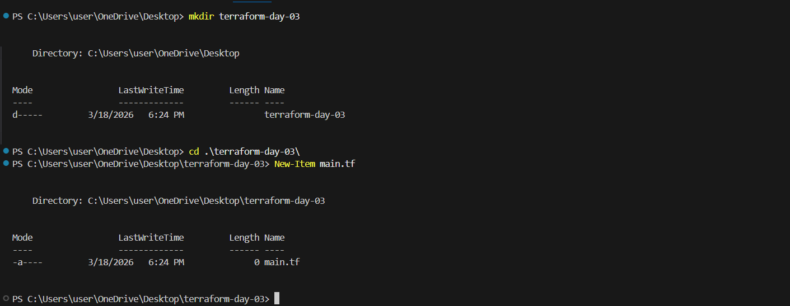
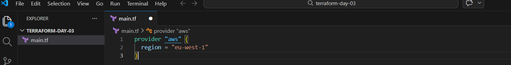
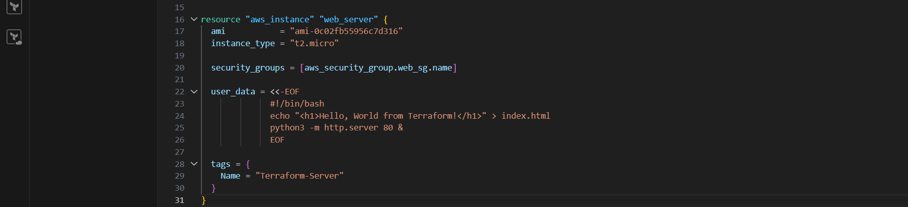
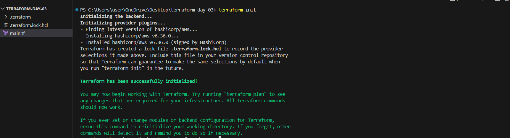
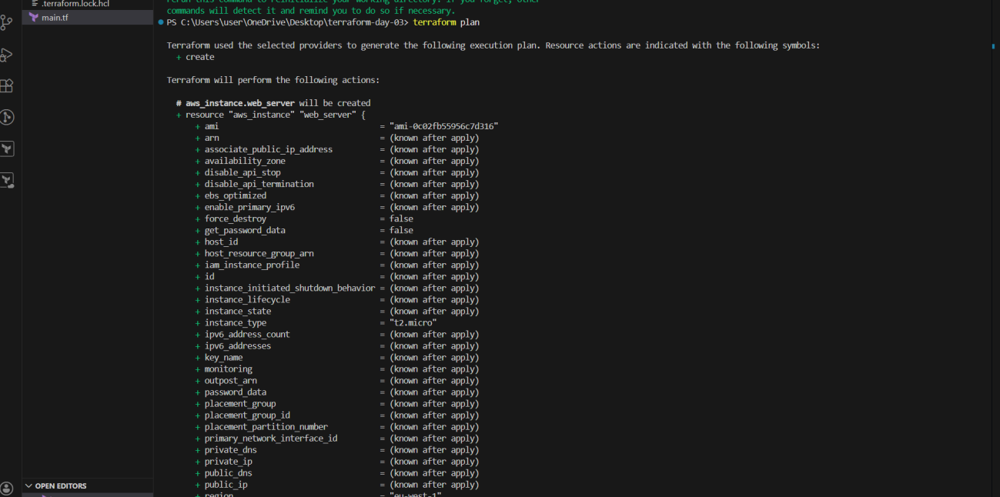
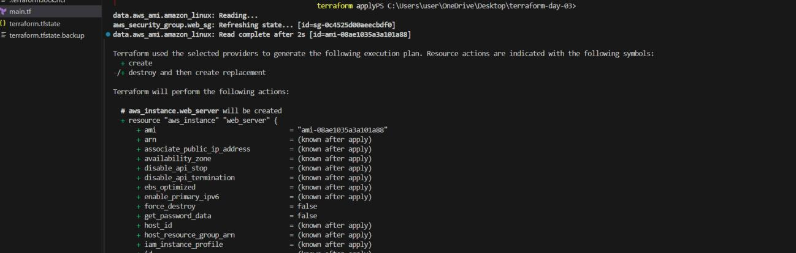
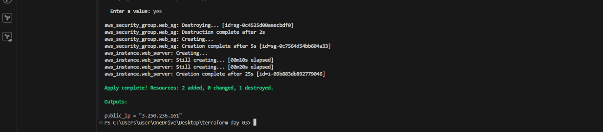
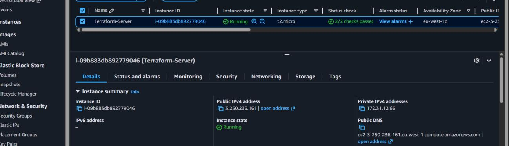
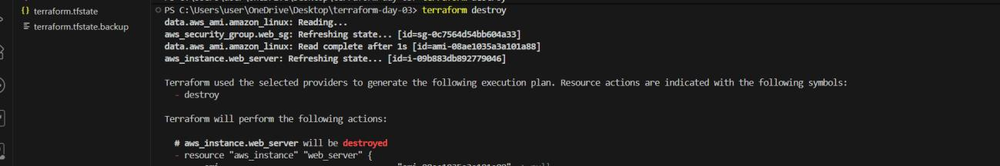
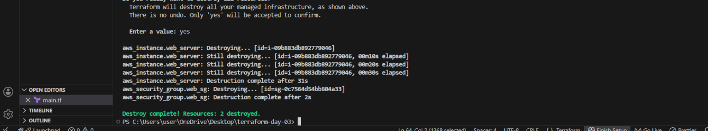

# ☁️ Day 3 — Deploying My First Server with Terraform

> **Infrastructure as Code | AWS EC2 | Terraform | DevOps Learning Journey**


---

## 📌 Overview

This project documents my **first real Infrastructure as Code (IaC) deployment** using Terraform.  
I provisioned a live EC2 web server on AWS entirely through code — no clicking in the console.

By the end of this lab, I had a publicly accessible server running in the cloud, deployed from a single `main.tf` file.

---

## 🎯 Objectives

- [x] Write my first Terraform configuration (`main.tf`)
- [x] Launch an EC2 instance on AWS using code
- [x] Configure a security group to allow HTTP traffic
- [x] Serve a live web page from the instance
- [x] Access the server via a browser using its public IP
- [x] Tear down all resources cleanly using `terraform destroy`

---

## 🛠️ Tools & Technologies

| Tool | Purpose |
|------|---------|
| **Terraform** | Infrastructure as Code — provision and manage cloud resources |
| **AWS EC2** | Virtual server (compute instance) in the cloud |
| **AWS CLI** | Authenticate and interact with AWS from the terminal |
| **Visual Studio Code** | Code editor for writing HCL configuration |
| **Windows Terminal** | Running Terraform CLI commands |

---

## 📁 Project Structure

```
terraform-day-03/
├── main.tf               # All Terraform configuration (provider + resources)
├── terraform.tfstate     # State file (auto-generated — tracks real infrastructure)
└── .terraform/           # Provider plugins (auto-generated by terraform init)
```

---

## 🚀 Step-by-Step Walkthrough

### Step 1 — Create Project Folder & Terraform File

Created a new project directory and initialized an empty `main.tf` configuration file.

```powershell
mkdir terraform-day-03
cd terraform-day-03
New-Item main.tf
```



---

### Step 2 — Write the Provider Block

Defined AWS as the cloud provider and set the deployment region.

```hcl
provider "aws" {
  region = "eu-west-1"
}
```

> 💡 The **provider block** tells Terraform *which cloud platform* to use and *where* to deploy resources.



---

### Step 3 — Create a Security Group (Allow HTTP)

Created a security group to open **port 80 (HTTP)** so the server is reachable from a browser.

```hcl
resource "aws_security_group" "web_sg" {
  name = "web-sg"

  ingress {
    from_port   = 80
    to_port     = 80
    protocol    = "tcp"
    cidr_blocks = ["0.0.0.0/0"]
  }
}
```

> 🔐 Without a security group rule, AWS blocks all inbound traffic by default. This rule opens port 80 to the internet.


---

### Step 4 — Create an EC2 Instance (Server)

Defined the virtual machine using a `resource` block, with a **user data script** to automatically install and start a simple web server on boot.

```hcl
resource "aws_instance" "web_server" {
  ami           = "ami-0c02fb55956c7d316"
  instance_type = "t2.micro"

  security_groups = [aws_security_group.web_sg.name]

  user_data = <<-EOF
    #!/bin/bash
    echo "<h3>Hello, World from Terraform!</h3>" > index.html
    python3 -m http.server 80 &
  EOF

  tags = {
    Name = "Terraform-Server"
  }
}
```

> ⚙️ The **resource block** defines *what* infrastructure gets created. The `user_data` script runs automatically when the EC2 instance first boots — this is how the web page is served without manual SSH access.



---

### Step 5 — Initialize Terraform

Before deploying, initialized the project to download the required AWS provider plugin.

```bash
terraform init
```

> 📦 `terraform init` downloads the **HashiCorp AWS provider** (v6.36.0) and creates a `.terraform.lock.hcl` file to lock provider versions for reproducibility.



---

### Step 6 — Plan the Deployment

Previewed all changes Terraform would make before actually applying them.

```bash
terraform plan
```

> 🔍 `terraform plan` is a **dry run** — it shows exactly what will be created, modified, or destroyed. Zero surprises when you apply.



---

### Step 7 — Deploy the Infrastructure

Applied the configuration to create real infrastructure in AWS.

```bash
terraform apply
```

Terraform prompted for confirmation, then:
- Destroyed the old security group (from a previous attempt)
- Created a new security group (`aws_security_group.web_sg`)
- Launched the EC2 instance (`aws_instance.web_server`)
- Output the **public IP address** of the running server

```
Apply complete! Resources: 2 added, 0 changed, 1 destroyed.

Outputs:
public_ip = "3.250.236.161"
```







---

### Step 8 — Access the Server in the Browser

Navigated to the public IP in a browser:

```
http://3.250.236.161
```

**Result:**


> 🎉 **A fully working web server — provisioned entirely through code.**  
> No manual clicks in the AWS console. No SSH. Just Terraform.

---

### Step 9 — Destroy All Resources

Cleaned up all infrastructure to avoid incurring AWS charges.

```bash
terraform destroy
```

```
Destroy complete! Resources: 2 destroyed.
```

> 💸 This is one of Terraform's most powerful features for learners and cloud engineers — **full lifecycle management**. You can spin up and tear down entire environments with a single command.





---

## 🧠 Key Concepts Learned

| Concept | What It Does |
|---------|-------------|
| `provider` block | Defines *where* to deploy (cloud platform + region) |
| `resource` block | Defines *what* to create (EC2 instance, security group, etc.) |
| `user_data` | Shell script that runs on instance boot — used to auto-configure the server |
| `terraform init` | Downloads provider plugins and prepares the working directory |
| `terraform plan` | Previews changes before execution — safe dry run |
| `terraform apply` | Creates real infrastructure from the configuration |
| `terraform destroy` | Removes all resources managed by the current state |
| `terraform.tfstate` | The state file — tracks what Terraform has deployed |

---

## ⚠️ Challenge Faced & Fix

**Problem:** Initial deployment failed due to an **invalid AMI ID**.

> AMI IDs are region-specific. An AMI that exists in `us-east-1` does not exist in `eu-west-1`.

**Fix:** Searched the AWS EC2 console → *AMI Catalog* → filtered for **Amazon Linux 2** in `eu-west-1` and replaced the AMI ID in `main.tf`.

**Lesson:** Always verify that your AMI ID is valid for your target region before running `terraform apply`.

---

## ✅ Outcome

By the end of this lab, I had successfully:

- ✔️ Deployed my first EC2 instance using Terraform (IaC)
- ✔️ Configured a security group for HTTP web access
- ✔️ Hosted a live web page using an automated `user_data` bootstrap script
- ✔️ Accessed a real cloud server through a browser via its public IP
- ✔️ Destroyed all infrastructure cleanly to avoid costs

---

## 💭 Reflection

> *"Today was a big milestone in my DevOps journey. Seeing a server come to life from just a configuration file felt powerful.*
>
> *It made me realize that Terraform is not just a tool — it's a way of thinking about infrastructure as something you can design, version, and automate like code.*
>
> *There were some errors along the way, but fixing them helped me understand how everything connects — from IAM permissions to networking.*
>
> *This is where things are starting to feel real."*

---

## 🗺️ What's Next

- [ ] Add `output` blocks to expose the public IP without reading state manually
- [ ] Use `variables.tf` to parameterize AMI ID, region, and instance type
- [ ] Add SSH key pair to enable remote access
- [ ] Deploy with a proper NGINX or Apache web server instead of Python's HTTP server
- [ ] Store Terraform state remotely using an S3 backend
- [ ] Integrate with CI/CD pipeline (GitHub Actions)

---

## 📚 Resources

- [Terraform AWS Provider Documentation](https://registry.terraform.io/providers/hashicorp/aws/latest/docs)
- [AWS EC2 AMI Finder](https://docs.aws.amazon.com/AWSEC2/latest/UserGuide/finding-an-ami.html)
- [Terraform CLI Commands Reference](https://developer.hashicorp.com/terraform/cli/commands)
- [AWS Free Tier](https://aws.amazon.com/free/)

---

*Part of my ongoing DevOps & Cloud Engineering learning journey. Building hands-on, one lab at a time.* 🚀
