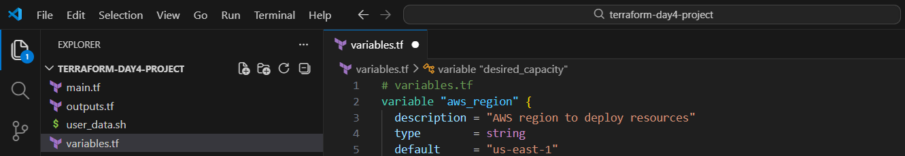
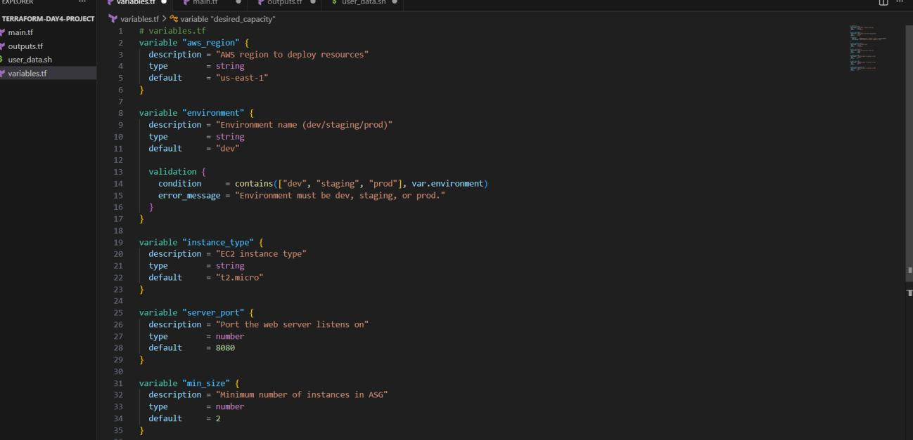
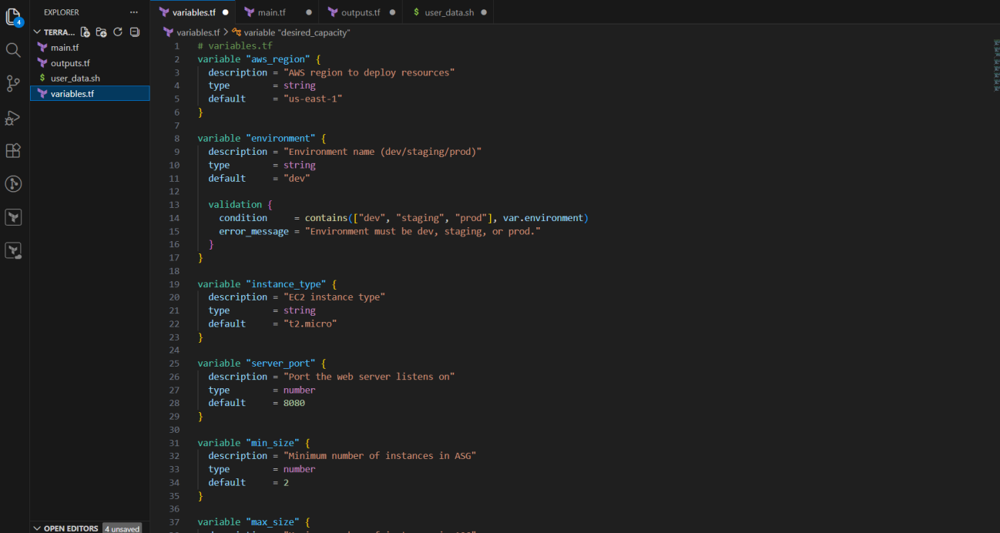
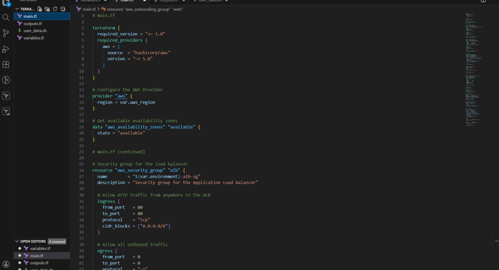
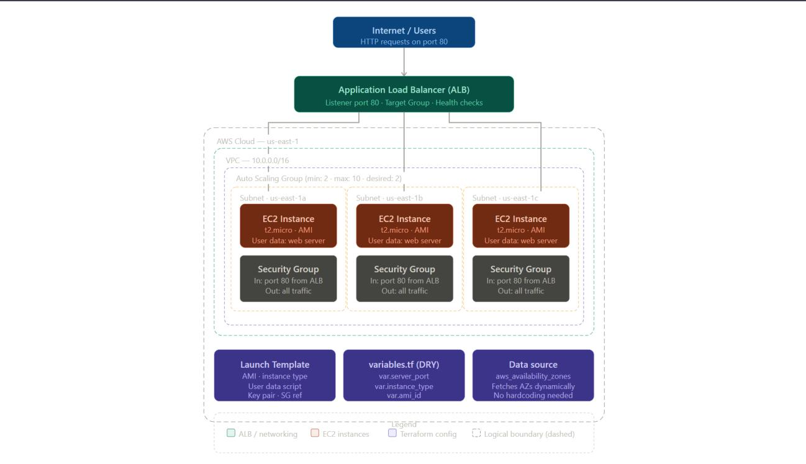
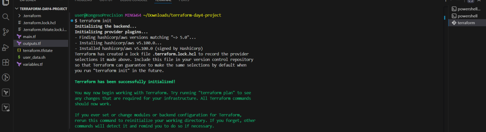
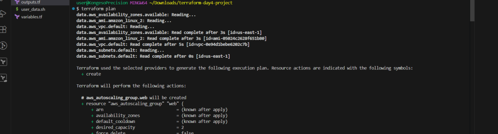
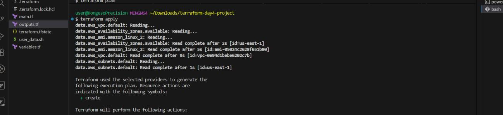
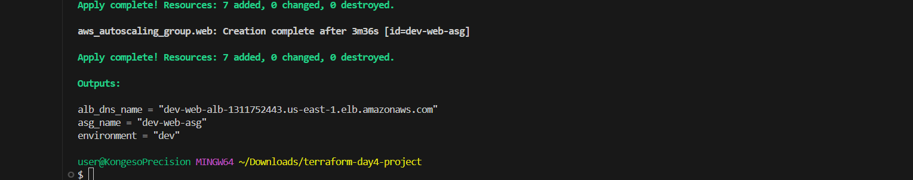

# 🚀 Day 4 – Mastering Basic Infrastructure with Terraform

> **#100DaysOfDevOps** | Terraform | AWS EC2 | Auto Scaling | Load Balancing | IaC


---

## 📌 Project Overview

In Day 4, I leveled up from a basic single-server setup to a **configurable, production-ready infrastructure** using Terraform. The key shift was applying the **DRY (Don't Repeat Yourself)** principle by introducing input variables, and extending the architecture to support a **highly available, load-balanced web application**.

**What I built:**
- Refactored Terraform configuration to replace hardcoded values with reusable input variables
- Deployed a **clustered web server environment** using an Auto Scaling Group (ASG) and Application Load Balancer (ALB)
- Validated the live deployment through the ALB DNS name
- Cleaned up all resources with `terraform destroy` to avoid unnecessary AWS costs

> **Live proof** — the browser returned `Hello from Terraform Cluster!` after deployment ✅


---

## 🛠️ Tools & Services Used

| Category | Tools |
|---|---|
| **Cloud Provider** | Amazon Web Services (AWS) |
| **Compute** | Amazon EC2, Auto Scaling Groups |
| **Networking** | Application Load Balancer (ALB), Target Groups |
| **Security** | AWS IAM, Security Groups |
| **IaC Tool** | Terraform (HashiCorp) |
| **CLI** | AWS CLI |
| **Editor** | Visual Studio Code |

---

## 💡 Key Concepts Learned

| Concept | What It Means in Practice |
|---|---|
| **Input Variables** | Replaced hardcoded values with `var.` references across the config |
| **DRY Principle** | One `variables.tf` file controls instance type, port, region, etc. |
| **Data Sources** | Used `aws_availability_zones` to dynamically fetch AZs |
| **Auto Scaling Group** | Ensures multiple EC2 instances are always running |
| **Application Load Balancer** | Distributes traffic across instances in multiple AZs |
| **High Availability** | Infrastructure keeps running even if one instance fails |
| **Scalable Design** | ASG scales up/down automatically based on demand |

---

## 📁 Project Structure

```
terraform-day4-project/
├── main.tf          # Core infrastructure configuration
├── variables.tf     # All input variables (DRY principle)
├── outputs.tf       # Output values (ALB DNS, ASG name, etc.)
└── user_data.sh     # Bootstrap script for EC2 web server
```



---

## 🔧 Configuration Breakdown

### Part 1 — Configurable Web Server (DRY Principle)

To apply the DRY principle, I created a `variables.tf` file that defines all configurable values in one place. This means I can change the port, instance type, region, or environment without touching the core `main.tf` file.

**Variables defined:**

```hcl
variable "aws_region" {
  description = "AWS region to deploy resources"
  type        = string
  default     = "us-east-1"
}

variable "environment" {
  description = "Environment name (dev/staging/prod)"
  type        = string
  default     = "dev"

  validation {
    condition     = contains(["dev", "staging", "prod"], var.environment)
    error_message = "Environment must be dev, staging, or prod."
  }
}

variable "instance_type" {
  description = "EC2 instance type"
  type        = string
  default     = "t2.micro"
}

variable "server_port" {
  description = "Port the web server listens on"
  type        = number
  default     = 8080
}

variable "min_size" {
  description = "Minimum number of instances in ASG"
  type        = number
  default     = 2
}
```





---

### Part 2 — Core Infrastructure (`main.tf`)

The `main.tf` file is structured into clean, logical blocks. No hardcoded values — everything references the variables defined in `variables.tf`.

**Blocks included:**

- `terraform {}` — provider version constraints
- `provider "aws"` — region set via `var.aws_region`
- `data "aws_availability_zones"` — dynamically fetches available AZs
- `resource "aws_security_group"` — for both the ALB and EC2 instances
- `resource "aws_launch_template"` — EC2 instance configuration
- `resource "aws_autoscaling_group"` — manages the cluster of instances
- `resource "aws_lb"` — the Application Load Balancer
- `resource "aws_lb_target_group"` — health checks and routing
- `resource "aws_lb_listener"` — forwards traffic from port 80



---

### Part 3 — Data Source Usage

Instead of hardcoding availability zones, I used a Terraform data block to fetch them dynamically:

```hcl
data "aws_availability_zones" "available" {
  state = "available"
}
```

This makes the configuration **region-agnostic** — it will work in any AWS region without modification.

---

## 🏗️ Architecture

The diagram below shows how all components connect:



**Traffic flow:**
```
Internet / Users (HTTP port 80)
        ↓
Application Load Balancer (ALB)
  → Listener (port 80) → Target Group → Health Checks
        ↓
Auto Scaling Group (min: 2, max: 10, desired: 2)
  ├── EC2 Instance (us-east-1a)  t2.micro | AMI | User data: web server
  ├── EC2 Instance (us-east-1b)  t2.micro | AMI | User data: web server
  └── EC2 Instance (us-east-1c)  t2.micro | AMI | User data: web server
        ↓
Security Groups — In: port 80 from ALB | Out: all traffic
```

**Terraform configuration layer:**
- **Launch Template** — AMI, instance type, user data script, key pair, SG ref
- **variables.tf (DRY)** — `var.server_port`, `var.instance_type`, `var.ami_id`
- **Data source** — `aws_availability_zones` fetches AZs dynamically (no hardcoding)

---

## ⚡ Terraform Workflow

### Step 1 — Initialize

```bash
terraform init
```

Downloads the AWS provider plugin and initializes the working directory.



---

### Step 2 — Plan

```bash
terraform plan
```

Previews all resources that will be created before applying any changes.



---

### Step 3 — Apply

```bash
terraform apply
```

Provisions the full infrastructure: ASG, ALB, security groups, target group, and listener.



**Apply complete — 7 resources added:**



The outputs confirmed:
- `alb_dns_name = "dev-web-alb-1311752443.us-east-1.elb.amazonaws.com"`
- `asg_name = "dev-web-asg"`
- `environment = "dev"`

---

### Step 4 — Verify

After deployment, I opened the ALB DNS name in a browser and got:


✅ **Load balancer was routing traffic correctly**  
✅ **Multiple EC2 instances were running behind the scenes**  
✅ **High availability confirmed**

---

### Step 5 — Destroy

```bash
terraform destroy
```

All resources were safely destroyed after testing to avoid unnecessary AWS charges.

---

## 🐛 Challenges & Fixes

### Challenge 1 — Incorrect Subnet Configuration
**Problem:** The Auto Scaling Group failed to deploy because availability zone names were used instead of actual VPC subnet IDs.  
**Fix:** Updated the ASG config to reference the correct VPC subnet IDs from the data source.

### Challenge 2 — Load Balancer Not Responding
**Problem:** The ALB returned no response after deployment.  
**Fix:** Corrected the security group rules and ensured the target group was properly attached to the ALB listener.

### Challenge 3 — User Data Script Not Executing
**Problem:** The EC2 instances launched but the web server wasn't starting.  
**Fix:** Properly formatted and base64-encoded the `user_data.sh` script in the launch template.

---

## 📊 Configurable vs. Clustered — Key Difference

| Feature | Configurable Server | Clustered Architecture |
|---|---|---|
| **Number of servers** | 1 | 2+ (managed by ASG) |
| **Load balancing** | ❌ | ✅ ALB distributes traffic |
| **Auto scaling** | ❌ | ✅ Scales up/down automatically |
| **Fault tolerance** | ❌ Single point of failure | ✅ If one fails, others keep running |
| **Flexibility** | Variables for easy config | Variables + dynamic data sources |
| **Use case** | Dev/testing | Production-ready |

---

## 🔑 DRY Principle in Practice

Without DRY:
```hcl
# Hardcoded everywhere - fragile and hard to maintain
resource "aws_instance" "web" {
  instance_type = "t2.micro"      # repeated in 5 places
  ami           = "ami-0abcdef"   # repeated in 3 places
}
```

With DRY (variables.tf):
```hcl
# Defined once, referenced everywhere
resource "aws_instance" "web" {
  instance_type = var.instance_type
  ami           = var.ami_id
}
```

**Benefits:**
- Change instance type in **one place**, it updates everywhere
- Reuse the same config for `dev`, `staging`, and `prod`
- Less room for human error when making environment-specific changes

---

## 🪞 Reflection

This project took several hours, mostly spent troubleshooting the ASG and ALB configuration. The most challenging part was understanding how all the pieces connect — especially how the ALB listener routes through the target group to reach the ASG instances.

The most rewarding moment was accessing the application through the load balancer and knowing that **multiple servers were running and serving traffic together behind the scenes**. This was the moment the concept of high availability clicked practically, not just theoretically.

This project marked a shift in how I think about infrastructure — from "one server doing everything" to **scalable, fault-tolerant systems** designed for production.

---

## 📚 Resources

- [Terraform AWS Provider Documentation](https://registry.terraform.io/providers/hashicorp/aws/latest/docs)
- [AWS Application Load Balancer Guide](https://docs.aws.amazon.com/elasticloadbalancing/latest/application/introduction.html)
- [AWS Auto Scaling Groups](https://docs.aws.amazon.com/autoscaling/ec2/userguide/AutoScalingGroup.html)
- [Terraform Input Variables](https://developer.hashicorp.com/terraform/language/values/variables)

---

## 🔗 Series Navigation

| Day | Topic | Link |
|---|---|---|
| Day 1 | Introduction to Terraform | Coming soon |
| Day 2 | Terraform State Management | Coming soon |
| Day 3 | Deploying an EC2 Instance | Coming soon |
| **Day 4** | **Variables, ASG & Load Balancing** | **You are here** |
| Day 5 | Terraform Modules | Coming soon |

---

*Part of my [#100DaysOfDevOps](https://github.com/ericgitau-tech) challenge — building real-world cloud infrastructure one day at a time.*
