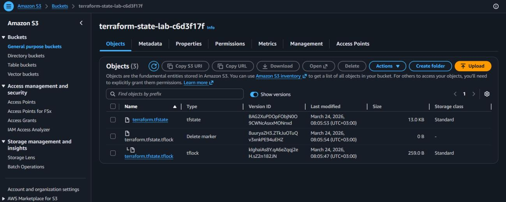
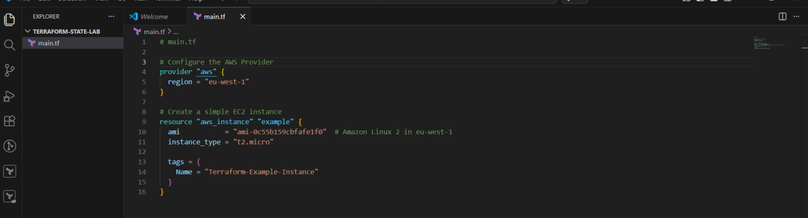
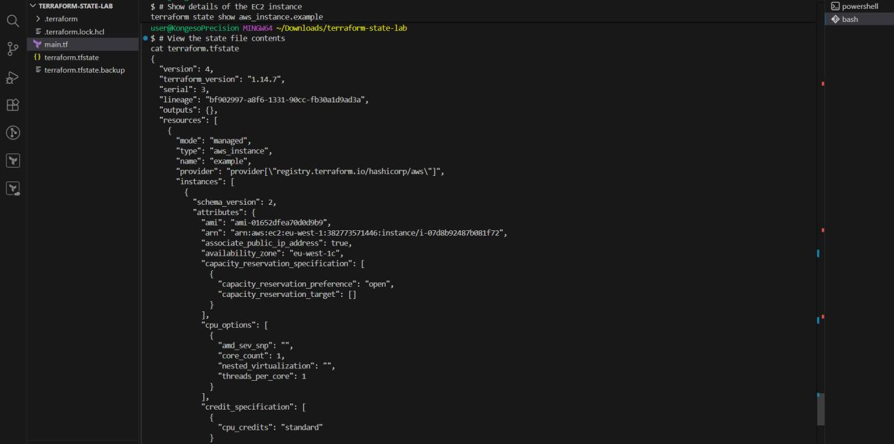
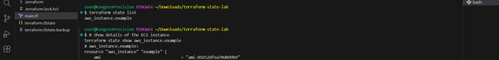
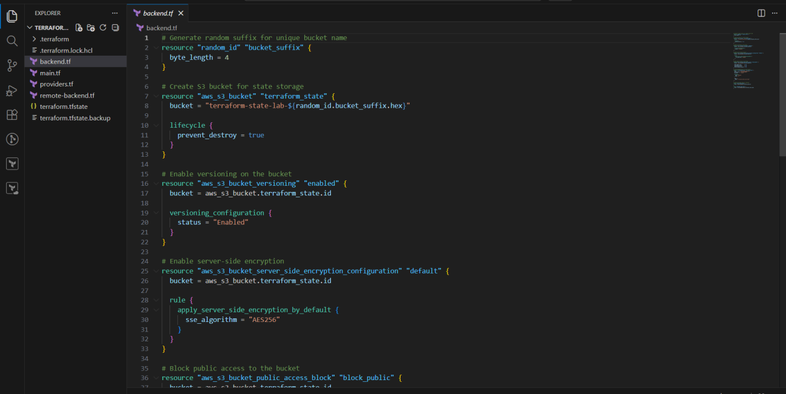
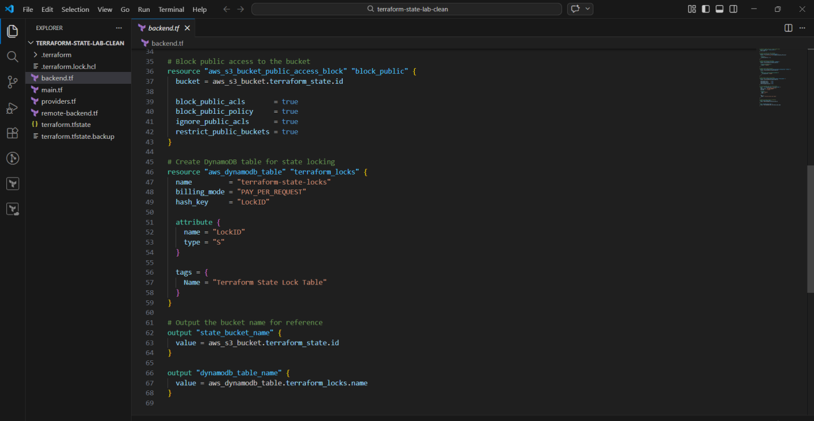
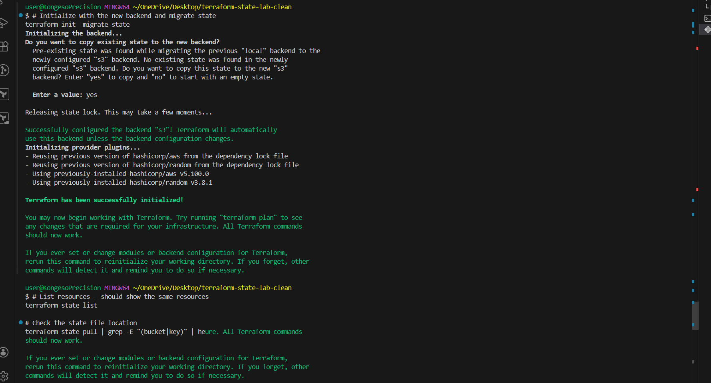
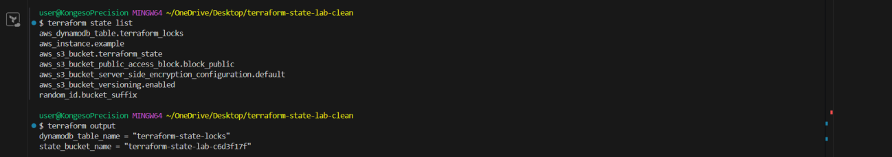
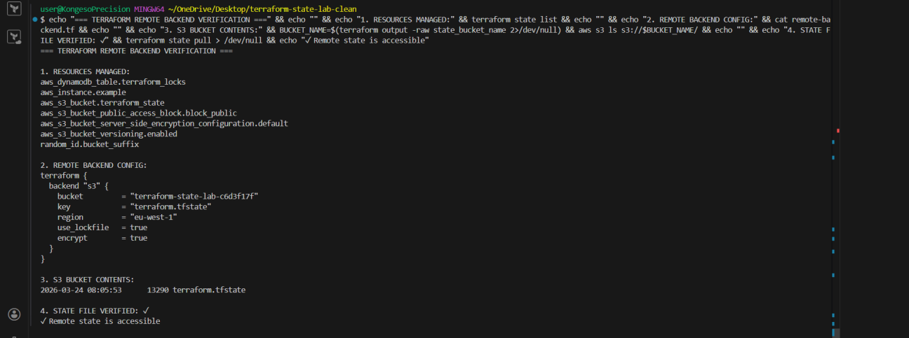

# 🚀 Day 6 – Understanding and Managing Terraform State

> **#100DaysOfDevOps** | Terraform | AWS S3 | DynamoDB | Remote Backend | State Locking


---

## 📌 Project Overview

Day 6 goes deep into one of the most critical — and often underestimated — components of Terraform: **state management**.

I started by understanding how Terraform stores infrastructure data locally, then identified the serious limitations of local state in team environments. From there, I configured a **remote backend using Amazon S3 and DynamoDB**, migrated my existing state, and tested state locking with concurrent terminal sessions.

By the end, I had a fully production-ready state management setup — with remote storage, versioning, encryption, and locking all working together.



---

## 🛠️ Tools & Services Used

| Category | Tools |
|---|---|
| **IaC Tool** | Terraform (HashiCorp) |
| **Remote State Storage** | Amazon S3 |
| **State Locking** | Amazon DynamoDB |
| **Compute** | Amazon EC2 |
| **Security** | AWS IAM |
| **CLI** | AWS CLI, Terraform CLI |
| **Editor** | Visual Studio Code |

---

## 💡 Key Concepts Learned

| Concept | What It Means |
|---|---|
| **Terraform State** | JSON file tracking all managed resources — the single source of truth |
| **State File Structure** | Stores resource IDs, ARNs, attributes, dependencies, and outputs |
| **Remote Backend** | Stores `terraform.tfstate` in S3 instead of locally |
| **State Locking** | DynamoDB prevents two operations from modifying state at the same time |
| **S3 Versioning** | Keeps previous state versions — protects against accidental deletion |
| **Encryption at Rest** | AES-256 ensures state file contents are never stored in plaintext |
| **Bootstrap Problem** | Backend resources must be created manually before Terraform can use them |
| **Drift Detection** | `terraform plan` compares real infra to state and flags any differences |

---

## 📁 Project Structure

```
terraform-state-lab/
├── backend.tf          # Remote S3 + DynamoDB backend configuration
├── main.tf             # EC2 instance resource
├── providers.tf        # AWS provider block
├── remote-backend.tf   # Backend infrastructure (S3 bucket + DynamoDB table)
├── terraform.tfstate        # Local state (before migration)
└── terraform.tfstate.backup # Backup created during migration
```

---

## 🗂️ Part 1 — Understanding Terraform State

### What Is the State File?

Terraform stores all managed infrastructure data in `terraform.tfstate` — a JSON file that acts as the **single source of truth**. Every `plan`, `apply`, and `destroy` operation reads this file to understand the current state of the world.

**The state file contains:**
- Resource IDs and ARNs
- Configuration attributes and computed values (e.g. public IPs)
- Metadata and dependency relationships between resources
- Output values

### Starting Configuration — EC2 Instance

The lab started with a simple EC2 instance to generate a local state file for inspection.



---

## 🔍 Part 2 — Inspecting State with CLI Commands

### List All Tracked Resources

```bash
terraform state list
```

Shows every resource currently tracked by Terraform.

### Inspect a Specific Resource

```bash
terraform state show aws_instance.example
```

Displays all stored attributes for a single resource — AMI, ARN, availability zone, IP addresses, instance type, tags, and more.





### Key Observations from the State File

Inspecting the raw `terraform.tfstate` file revealed:

- Full resource configuration details, including every attribute passed to AWS
- **Computed values** — such as public IPs and ARNs that are only known after apply
- Dependency relationships between resources
- Output values stored alongside resource data
- ⚠️ **Sensitive data in plain text** — credentials and resource details are stored unencrypted in local state, which makes secure remote storage essential

After running `terraform destroy`, the state file was updated to reflect that no resources exist — confirming that the state file is always kept in sync with real infrastructure.

---

## ☁️ Part 3 — Configuring Remote State Storage

Local state works for solo projects, but breaks down in team environments. Remote state solves this with centralized, secure, and collaborative storage.

### Why Remote State?

| Problem with Local State | Remote State Solution |
|---|---|
| Can't be shared across a team | Stored in S3 — accessible by all authorized users |
| No protection against concurrent edits | DynamoDB locking prevents simultaneous operations |
| Risk of accidental deletion | S3 versioning keeps full history of state changes |
| Sensitive data on local disk | AES-256 encryption at rest |
| Accidentally committed to Git | Lives in AWS — outside the repo entirely |

### backend.tf — Full Infrastructure Code

This file provisions everything needed before the remote backend can be used:

**S3 Bucket** (with versioning, encryption, and public access blocking) + **DynamoDB Table** (for state locking) + **Outputs** (bucket name and table name for reference).





### Key Backend Configuration Explained

```hcl
terraform {
  backend "s3" {
    bucket         = "terraform-state-lab-c6d3f17f"  # S3 bucket storing state
    key            = "terraform.tfstate"              # Path/filename in the bucket
    region         = "eu-west-1"                      # AWS region
    dynamodb_table = "terraform-state-locks"          # Enables state locking
    encrypt        = true                             # AES-256 encryption at rest
    use_lockfile   = true                             # Enforces locking on every operation
  }
}
```

> **The Bootstrap Problem:** Terraform cannot create the backend resources using itself — because Terraform needs a working backend to run. The solution is to create the S3 bucket and DynamoDB table manually (or with a separate Terraform run without a backend) before adding the backend block.

---

## 🔄 Part 4 — Migrating State to Remote Backend

After the backend infrastructure was in place and the `backend "s3"` block was added to the configuration, I ran:

```bash
terraform init -migrate-state
```

Terraform detected the new backend, compared it with the existing local state, and prompted for confirmation before migrating.



**What happened during migration:**
1. Terraform read the existing local `terraform.tfstate`
2. It uploaded the state file to the S3 bucket at the configured key path
3. The local state file was kept as a backup (`terraform.tfstate.backup`)
4. All subsequent operations now read from and write to S3

The S3 console confirmed the state file was uploaded successfully with versioning enabled — visible in the screenshot at the top of this README.

---

## 🔒 Part 5 — Testing State Locking

To prove that locking works, I ran two Terraform operations simultaneously from two terminals:

- **Terminal 1:** `terraform apply`
- **Terminal 2:** `terraform plan`

Terminal 2 immediately returned a lock error — Terraform refused to proceed because Terminal 1 held the DynamoDB lock.

**This confirmed that state locking prevents:**
- Overwriting changes from a concurrent operation
- State file corruption from simultaneous writes
- Infrastructure inconsistencies in team environments

After Terminal 1's operation completed, the lock was automatically released and Terminal 2 could proceed normally.

---

## ✅ Part 6 — Verifying the Full Setup

After migration, I ran a comprehensive verification to confirm all four components were working correctly:

```bash
# 1. Resources managed
terraform state list

# 2. Remote backend config confirmed
cat remote-backend.tf

# 3. S3 bucket contents
aws s3 ls s3://$BUCKET_NAME/

# 4. State file accessibility
terraform state pull | grep -E "(bucket|key)"
```





**Verification output confirmed:**
- ✅ All resources tracked correctly in remote state
- ✅ Remote backend config pointing to correct S3 bucket and DynamoDB table
- ✅ `terraform.tfstate` file present in S3 with correct size
- ✅ Remote state accessible — `Remote state is accessible`

---

## 🐛 Challenges & Fixes

| Challenge | Root Cause | Fix |
|---|---|---|
| S3 bucket creation failed | Bucket name already taken globally | Used a random suffix (`random_id` resource) to generate a unique bucket name |
| IAM permission errors | User lacked S3 and DynamoDB permissions | Attached the necessary IAM policies for `s3:*` and `dynamodb:*` to the user |
| State migration didn't trigger | Forgot to re-run `terraform init` after adding the backend block | Always run `terraform init` after any change to the `backend {}` block |

---

## 📖 Key Takeaways

**Never commit `terraform.tfstate` to Git.** The state file can contain sensitive data — passwords, access keys, private IPs — all in plain text. Add it to `.gitignore` immediately.

**Outputs are stored in the state file.** They aren't just display values — they're persisted and can be read by other Terraform configurations using `terraform_remote_state`.

**Remote state is a team requirement, not an optional upgrade.** Without it, two engineers running `terraform apply` at the same time can silently corrupt your infrastructure.

**S3 versioning is your safety net.** If a state file gets corrupted or accidentally overwritten, you can restore a previous version directly from the S3 console.

---

## 🔗 Series Navigation

| Day | Topic | Link |
|---|---|---|
| Day 3 | Deploying an EC2 Instance | Coming soon |
| Day 4 | Variables, ASG & Load Balancing | [View](../day-04-variables-asg-alb/) |
| Day 5 | Scaling Infrastructure & Terraform State | [View](../day-05-scaling-terraform-state/) |
| **Day 6** | **Remote State — S3 + DynamoDB Backend** | **You are here** |
| Day 7 | Terraform Modules | Coming soon |

---

*Part of my [#100DaysOfDevOps](https://github.com/ericgitau-tech) challenge — building real-world cloud infrastructure one day at a time.*
