# 🚀 Day 7 – Terraform State Isolation: Workspaces vs File Layouts

> **#100DaysOfDevOps** | Terraform | AWS S3 | DynamoDB | Multi-Environment | State Isolation


---

## 📌 Project Overview

In Day 7, I tackled one of the most important challenges in production Terraform: **how to manage dev, staging, and production environments without them interfering with each other**.

Building on the remote state setup from Day 6, I implemented and compared **two official approaches** to state isolation:

- **Workspaces** — multiple state files sharing the same configuration directory
- **File Layouts** — completely separate directories with independent configurations and backends

Both were deployed hands-on with real AWS infrastructure, and by the end I had a clear picture of when each approach is appropriate — and why file layouts are the industry recommendation for production.

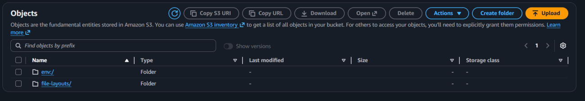

---

## 🛠️ Tools & Services Used

| Category | Tools |
|---|---|
| **IaC Tool** | Terraform (HashiCorp) |
| **Remote State Storage** | Amazon S3 |
| **State Locking** | Amazon DynamoDB |
| **Compute** | Amazon EC2 |
| **Security** | AWS IAM |
| **CLI** | AWS CLI, Terraform CLI |
| **Editor** | Visual Studio Code |

---

## 💡 Key Concepts Learned

| Concept | Description |
|---|---|
| **State Isolation** | Preventing one environment's state from affecting another |
| **Terraform Workspaces** | Multiple named states sharing a single config directory |
| **File Layouts** | Separate directories per environment, each with its own backend |
| **`terraform.workspace`** | Built-in variable to make config dynamic based on active workspace |
| **`terraform_remote_state`** | Data source allowing one config to read outputs from another |
| **Per-Environment Locking** | Each workspace/environment has its own DynamoDB lock — no cross-env conflicts |
| **Bootstrap Pattern** | Creating S3 + DynamoDB infrastructure before configuring the Terraform backend |

---

## 📁 Final Project Structure

```
terraform-day7/
├── env/                          # Workspace-based isolation
│   ├── main.tf                   # Single config, workspace-aware
│   └── terraform.tfstate         # (local backup before migration)
│
└── file-layouts/                 # File layout-based isolation
    ├── dev/
    │   └── main.tf               # Dev-specific config + backend
    ├── staging/
    │   └── main.tf               # Staging-specific config + backend
    └── production/
        └── main.tf               # Production-specific config + backend
```

---

## ☁️ Backend Setup — S3 + DynamoDB

Before either isolation approach could be used, I provisioned the remote backend infrastructure using AWS CLI commands:

```bash
# Create S3 bucket with unique name
BUCKET_NAME="terraform-state-$(date +%s)"
aws s3 mb s3://$BUCKET_NAME --region eu-west-1

# Enable versioning
aws s3api put-bucket-versioning \
  --bucket $BUCKET_NAME \
  --versioning-configuration Status=Enabled

# Create DynamoDB table for state locking
aws dynamodb create-table \
  --table-name terraform-state-locks \
  --attribute-definitions AttributeName=LockID,AttributeType=S \
  --key-schema AttributeName=LockID,KeyType=HASH \
  --billing-mode PAY_PER_REQUEST \
  --region eu-west-1
```

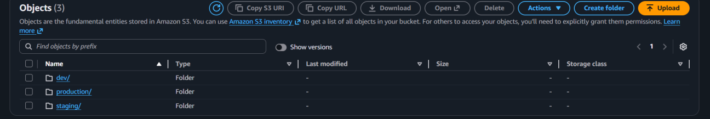

---

## 🔵 Approach 1 — State Isolation via Terraform Workspaces

### How Workspaces Work

Workspaces allow a single Terraform configuration to maintain **separate state files** for each environment. All environments share the same `main.tf` — only the active workspace changes which state file is used.

S3 stores the state under different key paths automatically:
```
env:/dev/terraform.tfstate
env:/staging/terraform.tfstate
env:/production/terraform.tfstate
```

### Creating and Switching Workspaces

```bash
# Create all three workspaces
terraform workspace new dev
terraform workspace new staging
terraform workspace new production

# List all workspaces
terraform workspace list

# Switch to a workspace before deploying
terraform workspace select dev

# Always verify before running apply
terraform workspace show
```

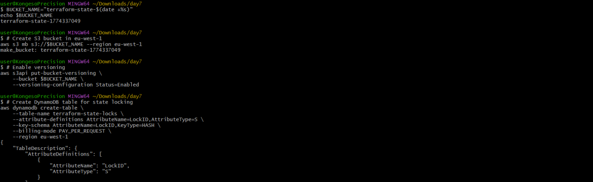

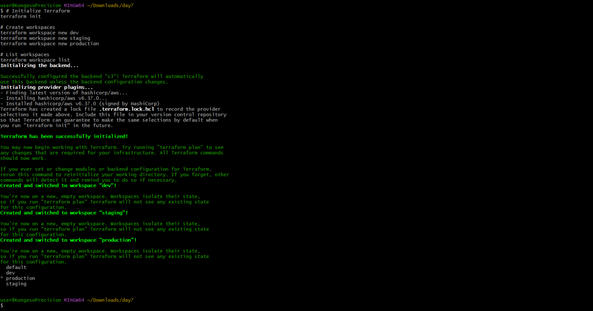

### Workspace-Aware Configuration

I modified `main.tf` to behave differently based on the active workspace using the `terraform.workspace` built-in variable:

```hcl
locals {
  instance_type = {
    dev        = "t2.micro"
    staging    = "t2.small"
    production = "t2.medium"
  }
}

resource "aws_instance" "web" {
  ami           = data.aws_ami.amazon_linux.id
  instance_type = local.instance_type[terraform.workspace]

  tags = {
    Name        = "web-${terraform.workspace}"
    Environment = terraform.workspace
  }
}
```

This single configuration automatically provisions the correct instance size for each environment — no code duplication required.

### Workspace State Isolation Confirmed in S3

After deploying across all three workspaces, I verified that S3 stored separate state files under distinct paths — proving that workspace state is fully isolated.

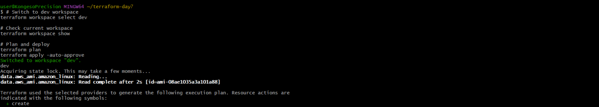

---

## 🟢 Approach 2 — State Isolation via File Layouts

### How File Layouts Work

File layouts take a fundamentally different approach: each environment lives in its **own directory** with its own `main.tf` and its own backend block pointing to a unique S3 key. There is no shared configuration at all.

### Directory Structure

```
file-layouts/
├── dev/
│   └── main.tf     # backend key: "file-layouts/dev/terraform.tfstate"
├── staging/
│   └── main.tf     # backend key: "file-layouts/staging/terraform.tfstate"
└── production/
    └── main.tf     # backend key: "file-layouts/production/terraform.tfstate"
```

### VS Code — File Layout Project View

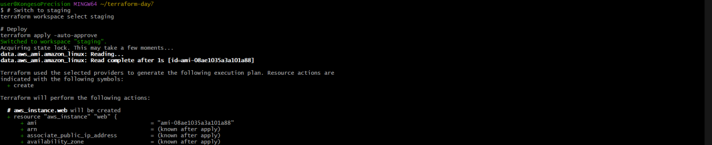

### Production `main.tf` — Fully Independent Config

Each environment's `main.tf` has its own backend block with a unique S3 key, its own instance type, and its own tags — completely decoupled from other environments.

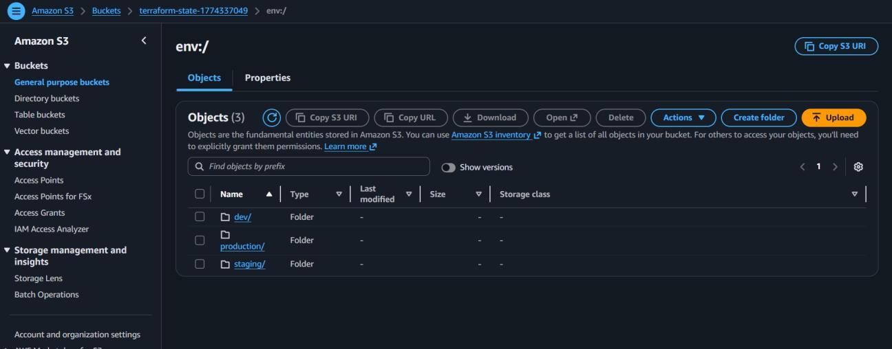

### Deploying Dev Environment

```bash
cd file-layouts/dev
terraform init      # Must be run in EACH directory
terraform apply -auto-approve
```

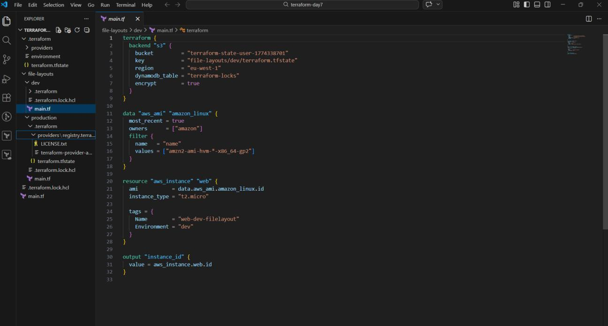

### Deploying Production Environment

```bash
cd file-layouts/production
terraform init
terraform apply -auto-approve
```

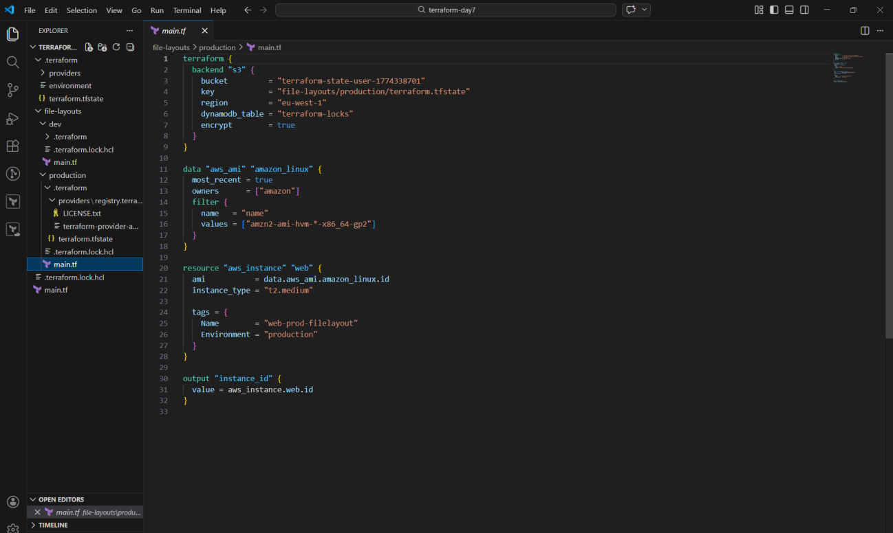

Each environment was initialized and deployed independently with zero shared state.

### Cross-Environment Data Sharing with `terraform_remote_state`

When one environment needs to reference outputs from another (e.g., production reading a VPC ID created by a networking config), the `terraform_remote_state` data source provides the solution:

```hcl
data "terraform_remote_state" "networking" {
  backend = "s3"
  config = {
    bucket = "terraform-state-bucket"
    key    = "file-layouts/networking/terraform.tfstate"
    region = "eu-west-1"
  }
}

# Access the output
resource "aws_instance" "app" {
  subnet_id = data.terraform_remote_state.networking.outputs.subnet_id
}
```

> ⚠️ This solves cross-environment dependencies but introduces tight coupling between configurations — use with care and document the dependency explicitly.

---

## 🔒 State Locking in Multi-Environment Context

With DynamoDB locking enabled, I verified that each workspace and each file layout environment uses a **separate lock entry** — identified by a unique `LockID` path.

This means:
- Deploying to `dev` does not block a concurrent deploy to `production`
- Each environment's operations are fully independent
- No cross-environment lock contention

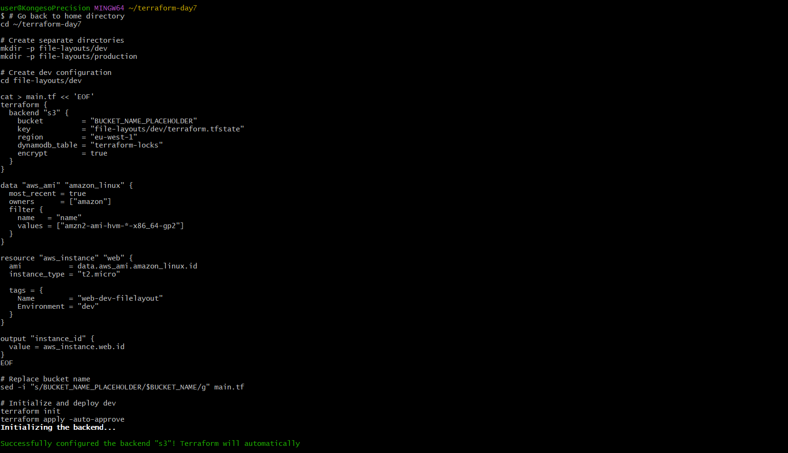

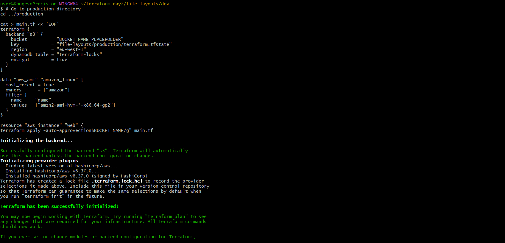

---

## ✅ All Instances Running — Final Verification

After deploying across both approaches, I verified all EC2 instances were running using the AWS CLI:

```bash
aws ec2 describe-instances \
  --query 'Reservations[*].Instances[*].[Tags[?Key==`Name`].Value[0],InstanceType,State.Name]' \
  --output table \
  --region eu-west-1
```

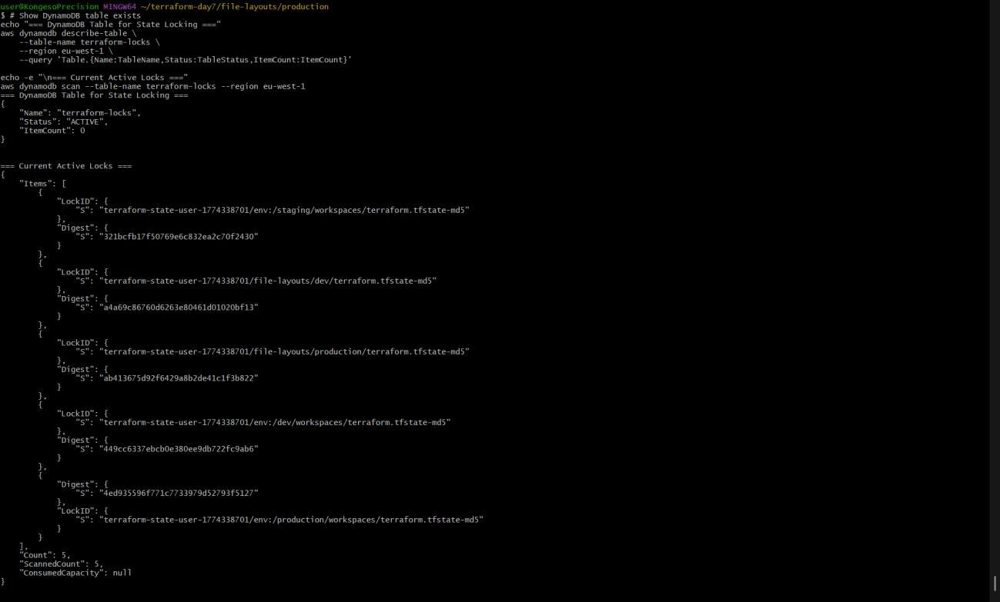

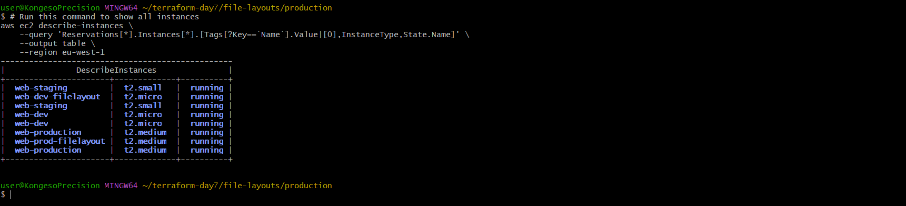

All 7 instances across workspaces and file layouts were running simultaneously:

| Instance Name | Type | Status |
|---|---|---|
| web-staging (workspace) | t2.small | ✅ running |
| web-dev-filelayout | t2.micro | ✅ running |
| web-staging (filelayout) | t2.micro | ✅ running |
| web-dev (workspace) | t2.micro | ✅ running |
| web-production (workspace) | t2.medium | ✅ running |
| web-prod-filelayout | t2.medium | ✅ running |
| web-production (filelayout) | t2.medium | ✅ running |

---

## ⚖️ Workspaces vs File Layouts — Full Comparison

| Criteria | Workspaces | File Layouts |
|---|---|---|
| **Isolation Strength** | Moderate — shared config, separate state | Strong — completely separate configs and state |
| **Risk of Misconfiguration** | High — wrong env if workspace not switched | Low — each directory is fully independent |
| **Scalability** | Limited for large teams | Scales well — clear separation and structure |
| **Setup Complexity** | Simple — single directory | More setup — separate directories required |
| **Production Use** | ❌ Not recommended | ✅ Recommended — safer and clearer |
| **Cross-Env Data Sharing** | Via workspace-aware data sources | Via `terraform_remote_state` data source |
| **Config Duplication** | None — single shared config | Some — each env has its own files |
| **Accidental Deploy Risk** | High — easy to forget workspace switch | Low — you must explicitly `cd` into the env |

### Bottom Line

Use **workspaces** for: quick local experiments, non-critical environments, or when you need rapid setup with a single config.

Use **file layouts** for: anything production-facing, team environments, or when you need the strongest guarantee that environments cannot accidentally affect each other.

---

## 🐛 Challenges & Fixes

**Challenge 1 — Deployed to the Wrong Environment**  
Forgot to switch workspaces before running `terraform apply`, causing changes to land in the wrong environment.  
**Fix:** Always run `terraform workspace show` before any apply to confirm the active workspace.

**Challenge 2 — Backend Initialization Errors**  
When `cd`-ing into a different file layout directory, Terraform threw initialization errors because the backend hadn't been initialized in that directory yet.  
**Fix:** Each environment directory requires its own `terraform init` before running `plan` or `apply`.

---

## 📖 Key Takeaways

**File layouts are the industry standard for production.** The complete separation of configuration and state between environments eliminates an entire class of accidental deployment errors.

**Workspaces are not a safety net.** Because all workspaces share the same configuration files, a bug in `main.tf` affects every environment at once. They're convenient, but not safe for critical infrastructure.

**`terraform.workspace` makes config dynamic — but adds complexity.** Conditional instance types and naming based on workspace are powerful, but the more logic you embed, the harder the config is to audit and debug.

**DynamoDB locking is per state file.** In a multi-environment setup, operations on different environments never block each other — each has its own lock entry.

---

## 🔗 Series Navigation

| Day | Topic | Link |
|---|---|---|
| Day 4 | Variables, ASG & Load Balancing | [View](../day-04-variables-asg-alb/) |
| Day 5 | Scaling Infrastructure & Terraform State | [View](../day-05-scaling-terraform-state/) |
| Day 6 | Remote State — S3 + DynamoDB Backend | [View](../day-06-remote-state-s3-dynamodb/) |
| **Day 7** | **State Isolation — Workspaces vs File Layouts** | **You are here** |
| Day 8 | Coming soon | — |

---

📎 **GitHub:** [github.com/ericgitau-tech/30-days-terraform-challenge](https://github.com/ericgitau-tech/30-days-terraform-challenge)

*Part of my [#100DaysOfDevOps](https://github.com/ericgitau-tech) challenge — building real-world cloud infrastructure one day at a time.*
