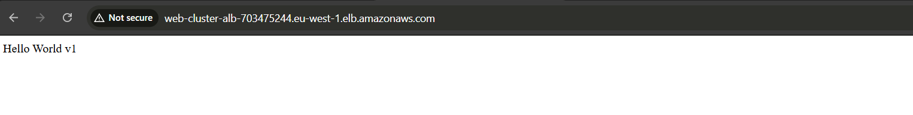
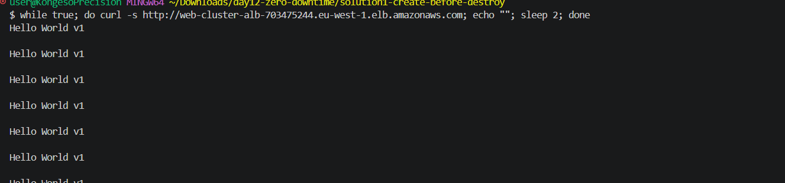
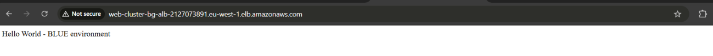
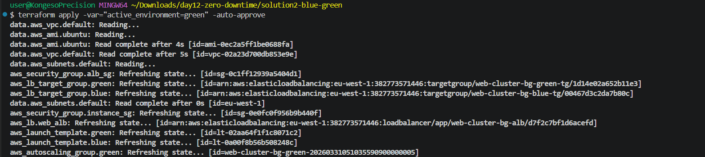
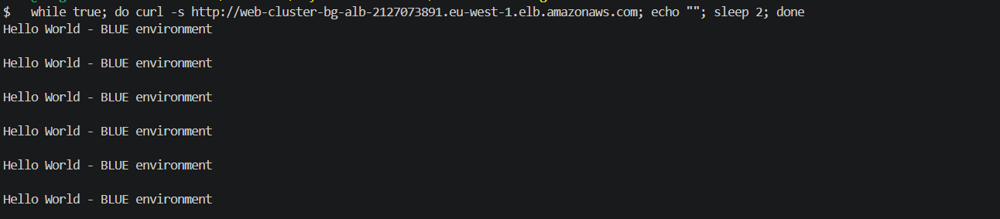

# 🚀 Day 12 – Zero-Downtime Deployments with Terraform

> **#100DaysOfDevOps** | Terraform | AWS ALB | Auto Scaling | create_before_destroy | Blue/Green


---

## 📌 Project Overview

Terraform's default behaviour for many resources is **destroy first, then create** — which means downtime. For an Auto Scaling Group this looks like:

1. Existing instances are terminated → traffic cannot be served
2. New instances are created → a gap exists during the switch
3. Users experience a service interruption → unacceptable in production

This lab demonstrates and **proves** two production-grade solutions that eliminate this problem entirely. Both were verified with a live traffic loop running throughout the entire deployment.

> *DevOps Rule: "If you didn't show proof, it didn't happen." ✅ Proof shown.*

---

## 🛠️ Tools & Services Used

| Category | Tools |
|---|---|
| **IaC Tool** | Terraform (HashiCorp) |
| **Compute** | Amazon EC2, Auto Scaling Groups (ASG) |
| **Networking** | Application Load Balancer (ALB), Target Groups |
| **OS / AMI** | Ubuntu (via `data.aws_ami`) |
| **Region** | `eu-west-1` |

---

## 💡 Key Concepts Learned

| Concept | Description |
|---|---|
| **`create_before_destroy`** | Terraform lifecycle rule — new resource is created and healthy before the old one is removed |
| **`name_prefix`** | Allows ASG to generate unique names automatically, enabling both old and new ASGs to coexist |
| **Blue/Green Deployment** | Two full environments maintained simultaneously — traffic switch is a single Terraform variable change |
| **ALB Listener Ternary** | A conditional expression on the listener routes traffic to blue or green target group |
| **Live Traffic Verification** | A `while true; do curl` loop running during `terraform apply` proves zero interruption |

---

## ⚠️ The Problem: Default Terraform Behaviour Causes Downtime

Without any lifecycle configuration, updating a launch template or ASG triggers a **destroy → create** cycle:

```
terraform apply -var="app_version=v2"

# Default flow (BAD for production):
# 1. Terraform destroys old ASG   ← downtime starts here
# 2. Terraform creates new ASG    ← downtime ends here
# Gap = users see errors or timeouts
```

Both solutions below eliminate this gap entirely.

---

## ✅ Solution 1 — `create_before_destroy`

### How It Works

```
1. New launch template is created (v2)
2. New ASG spins up with new instances
3. New instances pass ALB health checks
4. OLD ASG is destroyed only AFTER new one is healthy
5. Zero gap in service — traffic always has somewhere to go
```

### Terraform Configuration

```hcl
resource "aws_launch_template" "web_server" {
  name_prefix   = "${var.cluster_name}-"
  image_id      = data.aws_ami.ubuntu.id
  instance_type = var.instance_type

  lifecycle {
    create_before_destroy = true
  }
}

resource "aws_autoscaling_group" "web_asg" {
  name_prefix         = "${var.cluster_name}-"
  min_size            = var.min_size
  max_size            = var.max_size
  vpc_zone_identifier = data.aws_subnets.default.ids

  launch_template {
    id      = aws_launch_template.web_server.id
    version = "$Latest"
  }

  lifecycle {
    create_before_destroy = true
  }
}
```

### ⚠️ The ASG Naming Challenge

When `create_before_destroy` is active, the old and new ASGs **must exist at the same time** — but AWS does not allow two ASGs with the same name. The fix is to use `name_prefix` instead of `name`:

```hcl
# ❌ Wrong — causes "already exists" error during zero-downtime deploy
name = "${var.cluster_name}"

# ✅ Correct — Terraform appends a unique suffix automatically
name_prefix = "${var.cluster_name}-"
# Results in: "web-cluster-20240324abc", "web-cluster-20240324xyz"
```

### Live Proof — v1 to v2 Transition

A continuous request loop was run against the ALB DNS throughout the entire `terraform apply`:

```bash
while true; do
  curl -s http://<alb-dns>
  sleep 2
done
```

**Screenshot 1 — Initial deployment: browser showing Hello World v1**



**Screenshot 2 — Traffic loop running continuously against v1**



**The transition output — v1 → v2 with zero errors:**

```
Hello World v1
Hello World v1
Hello World v1
Hello World v2   ← new version, instant switch
Hello World v2
Hello World v2
```

✅ No errors &nbsp; ✅ No timeouts &nbsp; ✅ Smooth v1 → v2 transition

---

## ✅ Solution 2 — Blue/Green Deployment

### How It Works

Two complete, independent environments are deployed simultaneously:

```
BLUE  → current live version (serving real traffic)
GREEN → new version (fully deployed, tested, ready)

Switch: change one Terraform variable → instant traffic reroute
Rollback: change it back → instant revert to previous version
```

No instance restarts. No health check waiting. No gap.

### Terraform Configuration — ALB Listener Switch

The ALB listener uses a ternary conditional to decide which target group receives traffic:

```hcl
resource "aws_lb_listener" "http" {
  load_balancer_arn = aws_lb.web_alb.arn
  port              = 80
  protocol          = "HTTP"

  default_action {
    type = "forward"

    # A single variable controls which environment is live
    target_group_arn = var.active_environment == "blue"
      ? aws_lb_target_group.blue.arn
      : aws_lb_target_group.green.arn
  }
}
```

### Switching Traffic — One Command

```bash
# Switch all traffic from Blue to Green instantly
terraform apply -var="active_environment=green" -auto-approve

# Roll back instantly if needed
terraform apply -var="active_environment=blue" -auto-approve
```

This triggers a single ALB API call — no instances are touched, no health checks are waited on.

### Live Proof — Blue to Green Switch

**Screenshot 3 — Browser confirming BLUE environment is live**



**Screenshot 4 — Traffic loop showing BLUE responses repeating continuously**



**Screenshot 5 — `terraform apply` running while traffic loop continues uninterrupted**



✅ Traffic switched instantly &nbsp; ✅ No downtime &nbsp; ✅ No connection failures

The switch happened in a single ALB API call — no instance restarts, no downtime.

---

## ⚖️ Comparing Both Solutions

| Feature | `create_before_destroy` | Blue/Green |
|---|---|---|
| **Complexity** | Low | Medium |
| **Downtime** | None ✅ | None ✅ |
| **Test before release** | ❌ No | ✅ Yes — green is live before switch |
| **Instant rollback** | ❌ Requires re-deploy | ✅ One variable change |
| **Cost** | Medium — brief overlap of old + new | High — two full environments always running |
| **Best for** | Routine updates, low-risk changes | Major releases, high-risk changes |

### When to Use Each

**Use `create_before_destroy` when:**
- Deploying routine config or AMI updates
- Cost is a concern
- You don't need to validate the new version before it goes live
- The team is small and deploys are low-risk

**Use Blue/Green when:**
- Deploying major application changes
- You need to validate the new environment before switching traffic
- Instant rollback capability is a requirement
- You're managing high-traffic, revenue-critical services

---

## 📖 Key Takeaways

**`create_before_destroy` is a one-line safety net.** Adding it to your lifecycle block costs nothing and eliminates an entire class of deployment downtime with no architectural change.

**Blue/Green trades cost for control.** Running two environments is expensive, but the ability to test before switching — and roll back in seconds — is worth it for anything critical.

**`name_prefix` is required for zero-downtime ASG deployments.** Without it, the second ASG creation fails because AWS sees a name conflict while both environments coexist.

**The ALB ternary pattern is powerful.** A single `var.active_environment` variable is the only thing controlling which environment receives production traffic — clean, auditable, and version-controlled.

**Proof matters.** The live traffic loop running during `terraform apply` is not just a demo — it's the only honest way to verify that zero-downtime claims are actually true.

---

## 🔗 Series Navigation

| Day | Topic | Link |
|---|---|---|
| Day 11 | Terraform Conditionals | [View](../day-11-terraform-conditionals/) |
| **Day 12** | **Zero-Downtime Deployments** | **You are here** |
| Day 13 | Coming soon | — |

---

📎 **GitHub:** [github.com/ericgitau-tech/30-days-terraform-challenge](https://github.com/ericgitau-tech/30-days-terraform-challenge)

*Part of my [#100DaysOfDevOps](https://github.com/ericgitau-tech) challenge — building real-world cloud infrastructure one day at a time.*
