# 🔐 Day 13 — Managing Sensitive Data in Terraform

> **30-Day Terraform Challenge** | AWS Region: `eu-west-1` (Ireland)  
> **Author:** Eric Gitau | **Date:** March 31, 2026

---

## 📋 Table of Contents

- [Overview](#-overview)
- [The Three Leak Paths](#-the-three-leak-paths)
- [Architecture Diagram](#-architecture-diagram) 
- [Prerequisites](#-prerequisites)
- [Project Structure](#-project-structure)
- [Step-by-Step Implementation](#-step-by-step-implementation)
  - [Step 1 — Environment Setup](#step-1--environment-setup)
  - [Step 2 — Create the Secret in AWS Secrets Manager](#step-2--create-the-secret-in-aws-secrets-manager)
  - [Step 3 — Create the S3 State Bucket](#step-3--create-the-s3-state-bucket)
  - [Step 4 — Create the DynamoDB Lock Table](#step-4--create-the-dynamodb-lock-table)
  - [Step 5 — Write the Terraform Files](#step-5--write-the-terraform-files)
  - [Step 6 — Run Terraform](#step-6--run-terraform)
- [Screenshots — Evidence of Working Lab](#-screenshots--evidence-of-working-lab)
- [Key Concepts Explained](#-key-concepts-explained)
- [Errors Encountered & Fixed](#-errors-encountered--fixed)
- [Final Checklist](#-final-checklist)
- [Key Takeaways](#-key-takeaways)
- [Clean Up](#-clean-up)

---

## 🧠 Overview

Terraform is one of the most powerful infrastructure-as-code tools — but it also creates **three dangerous paths for secrets to leak**. If those paths are not closed, your database passwords and API keys can end up:

- Publicly visible on GitHub
- In plaintext on your laptop
- Logged in your CI/CD pipeline output

This lab closes all three paths using:

| Defence | Protects Against |
|---|---|
| **AWS Secrets Manager** | Hardcoded credentials in `.tf` files |
| **`sensitive = true`** | Values appearing in terminal/log output |
| **S3 remote state + encryption** | Secrets in `terraform.tfstate` |

---

## 💣 The Three Leak Paths

### Leak 1 — Hardcoded Secrets in `.tf` Files

```hcl
# ❌ DANGEROUS — never do this
resource "aws_db_instance" "example" {
  username = "admin"
  password = "super-secret-password"   # committed to Git forever
}
```

Once committed to Git, the password is in your history **permanently** — even if you delete the line later.

**Fix:** Fetch credentials from AWS Secrets Manager at runtime.

---

### Leak 2 — Default Values in Variable Blocks

```hcl
# ❌ DANGEROUS — visible to anyone reading the code
variable "db_password" {
  default = "super-secret-password"
}
```

**Fix:** Remove the default and mark the variable `sensitive = true`.

```hcl
# ✅ SAFE
variable "db_password" {
  type      = string
  sensitive = true
}
```

---

### Leak 3 — Secrets in the State File

Even if you do everything else correctly, Terraform writes a copy of **every resource it manages** into `terraform.tfstate`. This file contains secrets in plaintext.

```
# terraform.tfstate — plaintext, stored on your laptop by default
"password": "StrongPass123!"
```

**Fix:** Store state remotely in S3 with server-side encryption enabled.

---

## 🏗️ Architecture Diagram

```
┌─────────────────────────────────────────────────────────────────┐
│                        Developer Machine                         │
│                                                                   │
│   terraform plan / apply                                          │
│         │                                                         │
│         ▼                                                         │
│   ┌──────────────┐     fetches secret     ┌──────────────────┐  │
│   │  Terraform   │ ──────────────────────► │  AWS Secrets     │  │
│   │  (runtime)   │ ◄────────────────────── │  Manager         │  │
│   └──────┬───────┘    credentials in RAM   │  prod/db/creds   │  │
│          │                                  └──────────────────┘  │
│          │ injects at runtime                                      │
│          ▼                                                         │
│   ┌──────────────┐                         ┌──────────────────┐  │
│   │  AWS RDS     │                         │  S3 Backend      │  │
│   │  MySQL       │                         │  (state file)    │  │
│   │  db.t3.micro │                         │  encrypt = true  │  │
│   └──────────────┘                         └────────┬─────────┘  │
│                                                      │            │
│                                             ┌────────▼─────────┐ │
│                                             │  DynamoDB         │ │
│                                             │  terraform-locks  │ │
│                                             │  (state lock)     │ │
│                                             └──────────────────┘ │
└─────────────────────────────────────────────────────────────────┘
```

**Flow:** Credentials never touch a `.tf` file. They live in Secrets Manager and are fetched into RAM at runtime only.

---

## ✅ Prerequisites

Before starting, make sure you have:

- [ ] AWS CLI installed and working (`aws --version`)
- [ ] Terraform installed (`terraform --version`)
- [ ] An AWS account with permissions for: RDS, S3, DynamoDB, Secrets Manager
- [ ] AWS credentials configured (see Step 1)

---

## 📁 Project Structure

```
day13-security/
├── main.tf           # Provider, backend, data sources, RDS resource
├── variables.tf      # Sensitive variable declaration
├── outputs.tf        # Sensitive output definition
├── .gitignore        # Prevents committing state files and secrets
└── screenshots/      # Evidence screenshots for this README
```

---

## 🚀 Step-by-Step Implementation

### Step 1 — Environment Setup

Create the project folder and set AWS credentials as **environment variables** — never hardcode them in any file.

```bash
mkdir day13-security && cd day13-security
```

```bash
# Set credentials as environment variables (safe — session only, never on disk)
export AWS_ACCESS_KEY_ID="your-access-key-id"
export AWS_SECRET_ACCESS_KEY="your-secret-access-key"
export AWS_DEFAULT_REGION="eu-west-1"

# Verify they are set correctly
aws configure list
```

> **Why environment variables?** They exist only in your current terminal session. They are never written to disk, never committed to Git, and disappear when you close the terminal.

---

### Step 2 — Create the Secret in AWS Secrets Manager

Store your database credentials in Secrets Manager **before** writing any Terraform code. Terraform will fetch them at runtime.

```bash
aws secretsmanager create-secret \
  --name "prod/db/credentials" \
  --secret-string '{"username":"dbadmin","password":"StrongPass123!"}' \
  --region eu-west-1
```

**Expected response:**
```json
{
    "ARN": "arn:aws:secretsmanager:eu-west-1:382773571446:secret:prod/db/credentials-IRMZ5p",
    "Name": "prod/db/credentials",
    "VersionId": "5468cbe5-bcc2-49d9-aa8b-b172399f16fc"
}
```

> **The ARN is your secret's unique identifier.** Terraform will use it automatically via the data source.

---

### Step 3 — Create the S3 State Bucket

The state file must be stored remotely and encrypted. Create the bucket with these settings:

```bash
# Create the bucket
aws s3api create-bucket \
  --bucket ericgitau-terraform-state-bucket \
  --region eu-west-1 \
  --create-bucket-configuration LocationConstraint=eu-west-1
```

Then in the **AWS Console → S3 → your bucket**, enable:

| Setting | Value | Why |
|---|---|---|
| Block all public access | **ON** | Prevents accidental public exposure |
| Versioning | **Enabled** | Allows state file rollback if corrupted |
| Default encryption | **SSE-S3** | Encrypts the state file at rest |

---

### Step 4 — Create the DynamoDB Lock Table

DynamoDB acts as a mutex — it prevents two engineers from running `terraform apply` simultaneously, which would corrupt the state file.

```bash
aws dynamodb create-table \
  --table-name terraform-locks \
  --attribute-definitions AttributeName=LockID,AttributeType=S \
  --key-schema AttributeName=LockID,KeyType=HASH \
  --billing-mode PAY_PER_REQUEST \
  --region eu-west-1
```

**Wait for it to become active:**
```bash
aws dynamodb describe-table \
  --table-name terraform-locks \
  --region eu-west-1 \
  --query 'Table.TableStatus'
# Should return: "ACTIVE"
```

> **Without this table**, Terraform throws a `ResourceNotFoundException` error immediately when you try to run plan or apply. We hit this exact error in this lab — see [Errors Encountered](#-errors-encountered--fixed).

---

### Step 5 — Write the Terraform Files

#### `main.tf`

```hcl
terraform {
  required_providers {
    aws = {
      source  = "hashicorp/aws"
      version = "~> 5.0"
    }
  }

  # Remote state: encrypted, versioned, locked
  backend "s3" {
    bucket         = "ericgitau-terraform-state-bucket"
    key            = "prod/terraform.tfstate"
    region         = "eu-west-1"
    dynamodb_table = "terraform-locks"
    encrypt        = true               # ← state file encrypted at rest
  }
}

provider "aws" {
  region = "eu-west-1"
}

# ── Fetch credentials from Secrets Manager ──────────────────────────
# NO passwords in this file. Terraform fetches them at runtime.

data "aws_secretsmanager_secret" "db_credentials" {
  name = "prod/db/credentials"
}

data "aws_secretsmanager_secret_version" "db_credentials" {
  secret_id = data.aws_secretsmanager_secret.db_credentials.id
}

locals {
  db_credentials = jsondecode(
    data.aws_secretsmanager_secret_version.db_credentials.secret_string
  )
}

# ── RDS instance using credentials from Secrets Manager ─────────────
resource "aws_db_instance" "example" {
  engine         = "mysql"
  instance_class = "db.t3.micro"

  username = local.db_credentials["username"]   # ← from Secrets Manager
  password = local.db_credentials["password"]   # ← from Secrets Manager

  allocated_storage   = 10
  skip_final_snapshot = true
}
```

#### `variables.tf`

```hcl
variable "db_password" {
  type      = string
  sensitive = true   # ← hides value from all terminal output and logs
  # No default value — nothing to leak in source code
}
```

> **`sensitive = true` does NOT encrypt the value.** It only hides it from Terraform's output. The value still exists in the state file — which is why the encrypted S3 backend is also required.

#### `outputs.tf`

```hcl
output "db_connection" {
  value     = "mysql://${aws_db_instance.example.endpoint}"
  sensitive = true   # ← endpoint string will show as <sensitive> in output
}
```

#### `.gitignore`

```gitignore
# Terraform cache and plugin directory
.terraform/

# State files — contain secrets in plaintext
*.tfstate
*.tfstate.backup

# Variable files — may contain secret values
*.tfvars

# Override files
override.tf
override.tf.json
```

> **This is critical.** Without `.gitignore`, a `git add .` could accidentally commit your state file (containing plaintext secrets) to GitHub.

---

### Step 6 — Run Terraform

```bash
# 1. Initialise — downloads providers and connects to the S3 backend
terraform init

# 2. Preview what will be created
terraform plan

# 3. Create the resources
terraform apply
# Type 'yes' when prompted
```

**What you will see during plan — proof that secrets are hidden:**
```
+ username = (sensitive value)
+ password = (sensitive value)

Changes to Outputs:
  + db_connection = (sensitive value)
```

**What you will see after apply completes:**
```
Apply complete! Resources: 1 added, 0 changed, 0 destroyed.

Outputs:

db_connection = <sensitive>
```

The RDS instance was created in **5 minutes and 24 seconds**.

---

## 📸 Screenshots — Evidence of Working Lab

### 1. AWS Credentials + Secret Creation via CLI

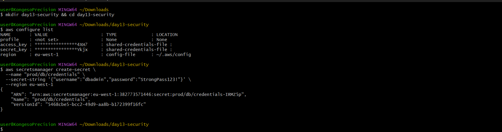

`aws configure list` confirms the region is `eu-west-1` and credentials are loaded from the shared credentials file (not hardcoded). The `create-secret` command returns the ARN confirming the secret was stored successfully.

---

### 2. AWS Secrets Manager Console — Secret Listed

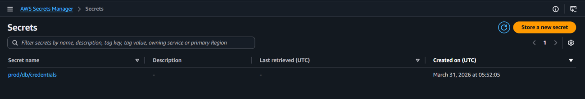

The secret `prod/db/credentials` is visible in the AWS Secrets Manager console, created on March 31, 2026. The secret value is NOT shown here — it requires an explicit click to retrieve.

---

### 3. `main.tf` — No Hardcoded Secrets

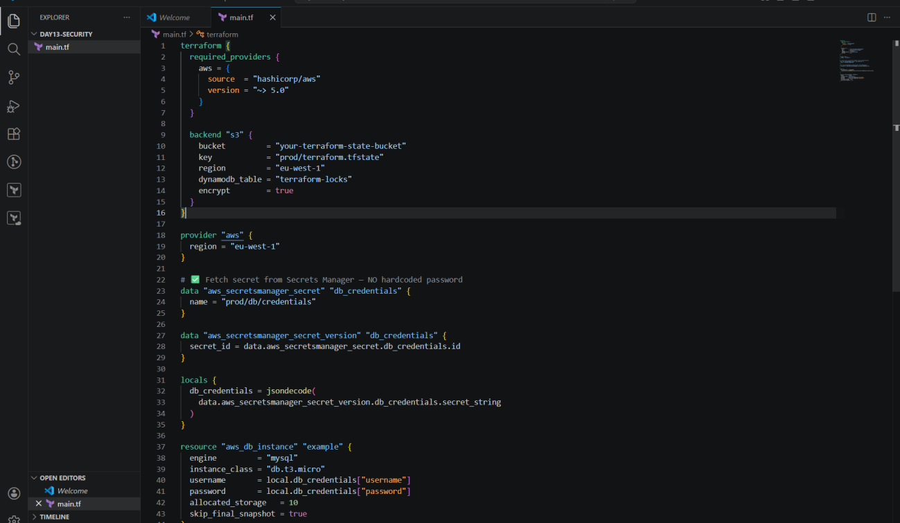

The full `main.tf` is visible in VS Code. The username and password fields reference `local.db_credentials["username"]` and `local.db_credentials["password"]` — fetched from Secrets Manager. No passwords anywhere in the file.

---

### 4. `variables.tf` — `sensitive = true` with No Default

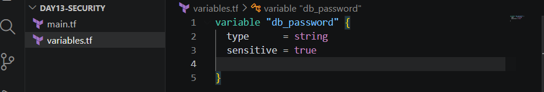

The `db_password` variable has `type = string` and `sensitive = true` but **no default value**. This means the value cannot leak through source code.

---

### 5. S3 State Bucket Created Successfully

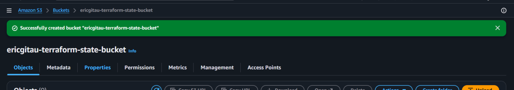

The S3 bucket `ericgitau-terraform-state-bucket` was created successfully in `eu-west-1` with versioning and encryption enabled.

---

### 6. `.gitignore` Protecting Sensitive Files

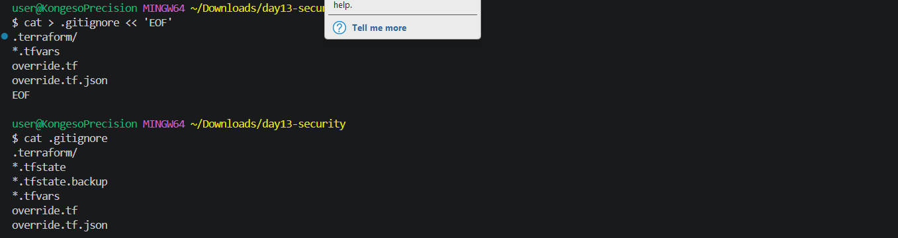

The `.gitignore` file contains all the critical patterns: `.terraform/`, `*.tfstate`, `*.tfstate.backup`, `*.tfvars`, `override.tf`, and `override.tf.json`. None of these files will ever be committed to Git.

---

### 7. Terraform Apply — State Lock Acquired


Terraform successfully acquires the DynamoDB state lock before starting the apply. The `var.db_password` prompt is visible — this variable exists with `sensitive = true` and no default.

---

### 8. Apply Complete — `db_connection = <sensitive>`

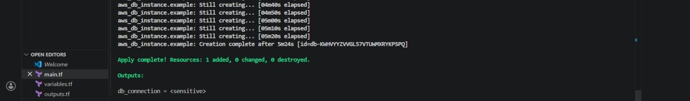

The key proof of the lab: after apply completes, the output shows `db_connection = <sensitive>` instead of the actual connection string. Resources: 1 added, 0 changed, 0 destroyed.

---

### 9. AWS RDS — Database Available in eu-west-1

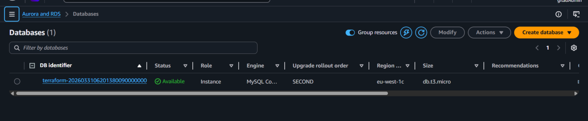

The MySQL RDS instance is visible in the AWS console with status **Available** in region `eu-west-1c` on a `db.t3.micro` instance class. The instance was created entirely through Terraform with credentials sourced from Secrets Manager.

---

### 10. Secrets Manager — Secret Detail Page

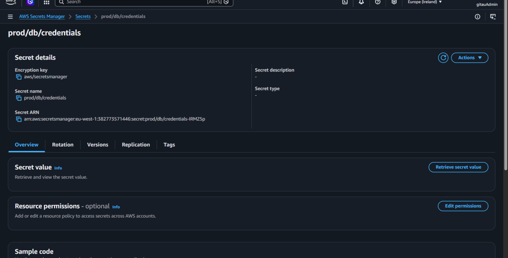

The secret detail page for `prod/db/credentials` showing the ARN, encryption key (`aws/secretsmanager`), and the "Retrieve secret value" button. The value is **not shown** — it must be explicitly retrieved, and access is controlled by IAM.

---

### 11. S3 Bucket — State File Uploaded Automatically

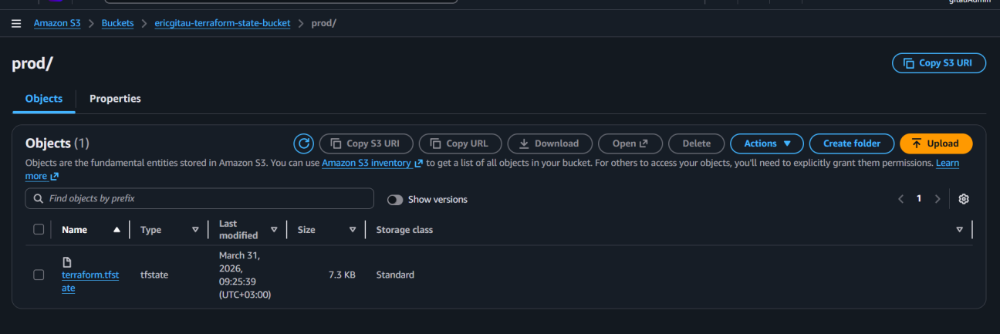

After `terraform apply`, the state file `terraform.tfstate` (7.3 KB) was automatically uploaded to the S3 bucket at path `prod/terraform.tfstate`. It is now encrypted at rest and versioned.

---

### 12. DynamoDB — Lock Table Active

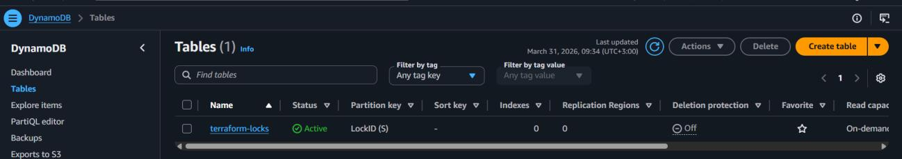

The `terraform-locks` DynamoDB table is in **Active** status with `LockID` as the partition key. Billing mode is On-demand. This table prevents concurrent state modifications.

---

## 📖 Key Concepts Explained

### How AWS Secrets Manager Integration Works

```
terraform plan / apply
       │
       ▼
data "aws_secretsmanager_secret"          ← looks up the secret by name
       │
       ▼
data "aws_secretsmanager_secret_version"  ← fetches the current version
       │
       ▼
locals { db_credentials = jsondecode(...) } ← decodes JSON into a map
       │
       ▼
resource "aws_db_instance" {
  username = local.db_credentials["username"]  ← used here, in RAM only
  password = local.db_credentials["password"]
}
```

The credentials **never touch a file**. They are fetched from the AWS API, held in memory, and injected into the resource — then discarded.

---

### What `sensitive = true` Does and Does Not Do

| `sensitive = true` DOES | `sensitive = true` DOES NOT |
|---|---|
| ✅ Hide value in terminal output | ❌ Encrypt value in the state file |
| ✅ Show `(sensitive value)` in plan | ❌ Prevent the value existing in state |
| ✅ Hide value in apply output | ❌ Replace the need for remote state |
| ✅ Prevent accidental log exposure | ❌ Protect against S3 bucket access |

**Bottom line:** `sensitive = true` + encrypted remote state = complete protection.

---

### Why the State File Is Dangerous

```bash
# Without remote state — your tfstate sits here on your laptop:
cat terraform.tfstate | grep password

# Output (plaintext):
"password": "StrongPass123!"
```

With S3 remote state and `encrypt = true`, the file is:
- Stored in AWS (not your laptop)
- Encrypted using AES-256 at rest
- Access-controlled by IAM
- Versioned (rollback possible)

---

### Vault vs AWS Secrets Manager

| Feature | AWS Secrets Manager | HashiCorp Vault |
|---|---|---|
| Best suited for | AWS-only environments | Multi-cloud / on-premise |
| Setup complexity | Low — fully managed | High — self-hosted |
| Access control | IAM policies | Fine-grained Vault policies |
| Cost | ~$0.40/secret/month | Free (open source) |
| Terraform integration | Native `aws_secretsmanager_*` data source | Requires `vault` provider |
| Secret rotation | Automatic (built-in) | Manual configuration |

**For AWS-only projects: use Secrets Manager.** For multi-cloud or teams already using Vault: use Vault.

---

## ⚠️ Errors Encountered & Fixed

### Error 1 — DynamoDB Table Not Found

**Symptom:**
```
│ Error: Error acquiring the state lock
│ ResourceNotFoundException: Requested resource not found
│ Unable to retrieve item from DynamoDB table "terraform-locks"
```

**Cause:** The DynamoDB table was configured in the backend block but not yet created in AWS.

**Fix:**
```bash
aws dynamodb create-table \
  --table-name terraform-locks \
  --attribute-definitions AttributeName=LockID,AttributeType=S \
  --key-schema AttributeName=LockID,KeyType=HASH \
  --billing-mode PAY_PER_REQUEST \
  --region eu-west-1
```

Wait until `TableStatus` returns `"ACTIVE"`, then rerun `terraform plan`.

---

### Error 2 — `var.db_password` Prompt on Every Run

**Symptom:**
```
var.db_password
  Enter a value:
```

**Cause:** The `db_password` variable was declared but never assigned a value. Terraform prompts for any unset variable.

**Fix:** Create `terraform.tfvars` with a placeholder value:
```hcl
db_password = "not-used-directly"
```

Add `*.tfvars` to `.gitignore` so it is never committed. The actual password continues to come from Secrets Manager — this just silences the prompt.

---

## ✅ Final Checklist

| Task | Status | Detail |
|---|---|---|
| Secret created in AWS Secrets Manager | ✅ | `prod/db/credentials` in eu-west-1 |
| Terraform fetches secret at runtime | ✅ | `data` source + `jsondecode()` |
| No hardcoded passwords in `.tf` files | ✅ | Verified in `main.tf` screenshot |
| Variables marked `sensitive = true` | ✅ | `variables.tf` confirmed |
| Outputs marked `sensitive = true` | ✅ | `db_connection = <sensitive>` in output |
| S3 remote backend configured | ✅ | `encrypt = true` in backend block |
| S3 bucket versioning enabled | ✅ | `ericgitau-terraform-state-bucket` |
| S3 bucket public access blocked | ✅ | All four public access settings ON |
| DynamoDB lock table created | ✅ | `terraform-locks`, Active status |
| State file uploaded to S3 | ✅ | `prod/terraform.tfstate` visible in S3 |
| `.gitignore` protecting sensitive files | ✅ | `*.tfstate`, `*.tfvars`, `.terraform/` |
| RDS instance deployed successfully | ✅ | MySQL `db.t3.micro`, 5m24s, Available |

---

## 🧠 Key Takeaways

> **"How do you manage secrets in Terraform?"** is a top interview question for infrastructure roles. Here is the complete answer:

1. **Never hardcode secrets in `.tf` files.** Use AWS Secrets Manager (or HashiCorp Vault for multi-cloud) and fetch credentials via a `data` source at runtime.

2. **Mark sensitive variables and outputs with `sensitive = true`.** This prevents accidental exposure in terminal output and CI/CD logs — but does not encrypt the underlying value.

3. **Always use remote state with encryption.** The state file contains everything Terraform knows about your infrastructure, including secrets. Store it in S3 with `encrypt = true`, block public access, enable versioning, and use DynamoDB for locking.

4. **`.gitignore` is your last line of defence.** Always exclude `*.tfstate`, `*.tfstate.backup`, `*.tfvars`, and `.terraform/` from version control.

5. **`sensitive = true` hides, but does not encrypt.** You need both the sensitive flag AND remote state encryption for complete protection.

---

## 🧹 Clean Up

RDS instances incur hourly charges even when idle. Destroy everything when done:

```bash
terraform destroy
# Type 'yes' when prompted
```

This removes the RDS instance. The S3 bucket and DynamoDB table are cheap (~$0) and can be kept for future labs.

To also remove the S3 bucket and DynamoDB table:
```bash
# Empty the bucket first
aws s3 rm s3://ericgitau-terraform-state-bucket --recursive

# Delete the bucket
aws s3api delete-bucket \
  --bucket ericgitau-terraform-state-bucket \
  --region eu-west-1

# Delete the DynamoDB table
aws dynamodb delete-table \
  --table-name terraform-locks \
  --region eu-west-1
```

---

## 🔗 References

- [AWS Secrets Manager Documentation](https://docs.aws.amazon.com/secretsmanager/latest/userguide/intro.html)
- [Terraform S3 Backend Documentation](https://developer.hashicorp.com/terraform/language/backend/s3)
- [Terraform Sensitive Values](https://developer.hashicorp.com/terraform/language/values/outputs#sensitive-suppressing-values-in-cli-output)
- [HashiCorp Vault vs AWS Secrets Manager](https://developer.hashicorp.com/vault/docs/vs/aws-secrets)

---

<div align="center">

**#30DayTerraformChallenge | #Terraform | #AWS | #DevOps | #Security | #IaC**

*Security is not optional in DevOps.*

</div>
